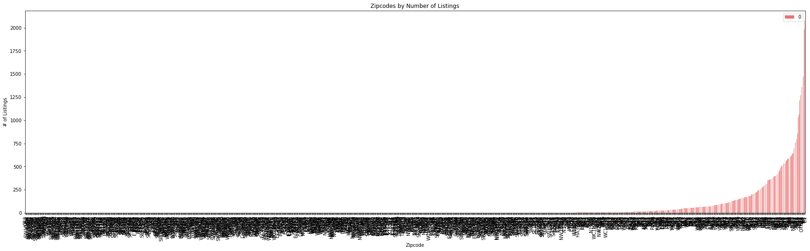
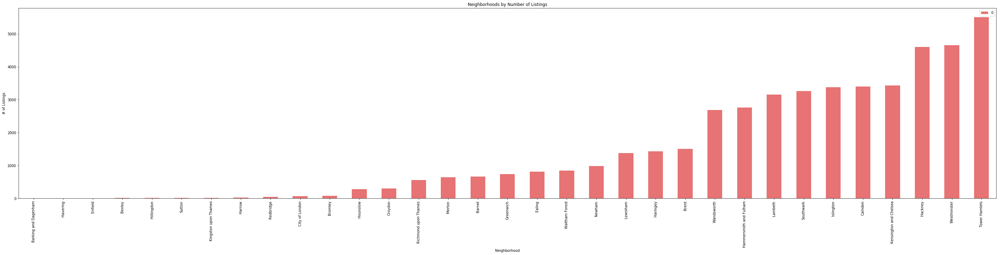
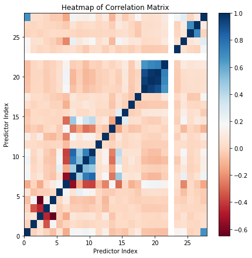
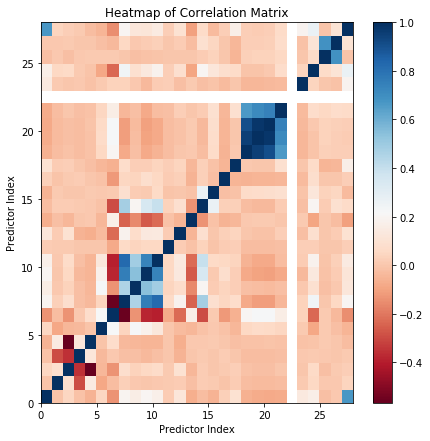

This post aims at modelling the prices of Airbnb appartments in London. In other words, the aim is to build our own price suggestion model. The data used in this post has been downloaded from the http://insideairbnb.com/ website. The data has been collected in April 2018. This work is inspired from the Airbnb price prediction model built by Dino Rodriguez, Chase Davis, and Ayomide Opeyemi.

This post contains two main parts:
* the data preprocessing, which aims at cleaning the data and selecting the most useful features for the models.
* the modelling with 3 different algorithms: Random Forests, XGBoost and a Neural Network.

The libraries used are the following:
* pandas
* matplotlib
* numpy
* collection
* scikit-learn
* xgboost

Let's start with the first part, data preprocessing.

# Data Preprocessing

The first thing to do is to set the seed in order to be able to reproduce the results.


```python
import random
random.seed(42)
```

## Import data 

Then I import the listings gathered in the csv file.


```python
# Import data

import pandas as pd

main_file_path = 'listings.csv' 
data = pd.read_csv(main_file_path, low_memory=False)

print(data.columns)
```

    Index(['id', 'listing_url', 'scrape_id', 'last_scraped', 'name', 'summary',
           'space', 'description', 'experiences_offered', 'neighborhood_overview',
           'notes', 'transit', 'access', 'interaction', 'house_rules',
           'thumbnail_url', 'medium_url', 'picture_url', 'xl_picture_url',
           'host_id', 'host_url', 'host_name', 'host_since', 'host_location',
           'host_about', 'host_response_time', 'host_response_rate',
           'host_acceptance_rate', 'host_is_superhost', 'host_thumbnail_url',
           'host_picture_url', 'host_neighbourhood', 'host_listings_count',
           'host_total_listings_count', 'host_verifications',
           'host_has_profile_pic', 'host_identity_verified', 'street',
           'neighbourhood', 'neighbourhood_cleansed',
           'neighbourhood_group_cleansed', 'city', 'state', 'zipcode', 'market',
           'smart_location', 'country_code', 'country', 'latitude', 'longitude',
           'is_location_exact', 'property_type', 'room_type', 'accommodates',
           'bathrooms', 'bedrooms', 'beds', 'bed_type', 'amenities', 'square_feet',
           'price', 'weekly_price', 'monthly_price', 'security_deposit',
           'cleaning_fee', 'guests_included', 'extra_people', 'minimum_nights',
           'maximum_nights', 'calendar_updated', 'has_availability',
           'availability_30', 'availability_60', 'availability_90',
           'availability_365', 'calendar_last_scraped', 'number_of_reviews',
           'first_review', 'last_review', 'review_scores_rating',
           'review_scores_accuracy', 'review_scores_cleanliness',
           'review_scores_checkin', 'review_scores_communication',
           'review_scores_location', 'review_scores_value', 'requires_license',
           'license', 'jurisdiction_names', 'instant_bookable',
           'cancellation_policy', 'require_guest_profile_picture',
           'require_guest_phone_verification', 'calculated_host_listings_count',
           'reviews_per_month'],
          dtype='object')
    

As this file has 95 columns, I decide to have a look at the features names to delete the ones that directly seem useless. This is my first feature selection step.

## Feature Selection


```python
useless = ['id', 'listing_url', 'scrape_id', 'last_scraped', 'name', 'summary',
       'space', 'description', 'experiences_offered', 'neighborhood_overview',
       'notes', 'transit', 'access', 'interaction', 'house_rules',
       'thumbnail_url', 'medium_url', 'picture_url', 'xl_picture_url',
       'host_id', 'host_url', 'host_name', 'host_since', 'host_location',
       'host_about', 'host_response_time', 'host_response_rate',
       'host_acceptance_rate', 'host_is_superhost', 'host_thumbnail_url',
       'host_picture_url', 'host_neighbourhood', 'host_listings_count',
       'host_verifications', 'host_has_profile_pic', 'host_identity_verified',
       'city', 'state', 'market', 'smart_location', 'country_code', 'country',
       'is_location_exact', 'weekly_price', 'monthly_price']
data.drop(useless, axis=1, inplace=True)
```

I also decide to delete the following features as they are only available for old Airbnb appartments. Let's imagine that I am new on Airbnb and I want to rent my appartment. At that time, I won't have any review score for my appartment. This is what is called leaky predictors, and these features should not be part of my model.


```python
# Drop reviews features as they are not available for new apartments in Airbnb
useless = ['number_of_reviews', 'first_review', 'last_review', 'review_scores_rating',
           'review_scores_accuracy', 'review_scores_cleanliness',
           'review_scores_checkin', 'review_scores_communication',
           'review_scores_location', 'review_scores_value', 'reviews_per_month']
data.drop(useless, axis=1, inplace=True)
```

### Selection on numerical data

Let's have a look at the numerical variables. Using the `describe` function, we are able to spot the features which have missing values.


```python
data.describe()
```
<table border="1" class="dataframe">
  <thead>
    <tr style="text-align: right;">
      <th></th>
      <th>host_total_listings_count</th>
      <th>neighbourhood_group_cleansed</th>
      <th>latitude</th>
      <th>longitude</th>
      <th>accommodates</th>
      <th>bathrooms</th>
      <th>bedrooms</th>
      <th>beds</th>
      <th>square_feet</th>
      <th>guests_included</th>
      <th>minimum_nights</th>
      <th>maximum_nights</th>
      <th>has_availability</th>
      <th>availability_30</th>
      <th>availability_60</th>
      <th>availability_90</th>
      <th>availability_365</th>
      <th>license</th>
      <th>calculated_host_listings_count</th>
    </tr>
  </thead>
  <tbody>
    <tr>
      <th>count</th>
      <td>53895.000000</td>
      <td>0.0</td>
      <td>53904.000000</td>
      <td>53904.000000</td>
      <td>53904.000000</td>
      <td>53644.000000</td>
      <td>53811.000000</td>
      <td>53731.000000</td>
      <td>582.000000</td>
      <td>53904.000000</td>
      <td>53904.000000</td>
      <td>5.390400e+04</td>
      <td>0.0</td>
      <td>53904.000000</td>
      <td>53904.000000</td>
      <td>53904.000000</td>
      <td>53904.000000</td>
      <td>0.0</td>
      <td>53904.000000</td>
    </tr>
    <tr>
      <th>mean</th>
      <td>15.885500</td>
      <td>NaN</td>
      <td>51.510425</td>
      <td>-0.127105</td>
      <td>3.036676</td>
      <td>1.262751</td>
      <td>1.353980</td>
      <td>1.708027</td>
      <td>577.508591</td>
      <td>1.407428</td>
      <td>3.285229</td>
      <td>2.683750e+05</td>
      <td>NaN</td>
      <td>11.830755</td>
      <td>25.337674</td>
      <td>40.514433</td>
      <td>155.849789</td>
      <td>NaN</td>
      <td>14.976106</td>
    </tr>
    <tr>
      <th>std</th>
      <td>84.700442</td>
      <td>NaN</td>
      <td>0.045454</td>
      <td>0.088346</td>
      <td>1.907429</td>
      <td>0.547699</td>
      <td>0.841912</td>
      <td>1.201165</td>
      <td>726.154243</td>
      <td>1.040308</td>
      <td>28.536837</td>
      <td>2.317162e+07</td>
      <td>NaN</td>
      <td>12.178077</td>
      <td>24.064923</td>
      <td>36.383218</td>
      <td>144.032928</td>
      <td>NaN</td>
      <td>81.750305</td>
    </tr>
    <tr>
      <th>min</th>
      <td>0.000000</td>
      <td>NaN</td>
      <td>51.292892</td>
      <td>-0.501305</td>
      <td>1.000000</td>
      <td>0.000000</td>
      <td>0.000000</td>
      <td>0.000000</td>
      <td>0.000000</td>
      <td>1.000000</td>
      <td>1.000000</td>
      <td>1.000000e+00</td>
      <td>NaN</td>
      <td>0.000000</td>
      <td>0.000000</td>
      <td>0.000000</td>
      <td>0.000000</td>
      <td>NaN</td>
      <td>1.000000</td>
    </tr>
    <tr>
      <th>25%</th>
      <td>1.000000</td>
      <td>NaN</td>
      <td>51.485099</td>
      <td>-0.187191</td>
      <td>2.000000</td>
      <td>1.000000</td>
      <td>1.000000</td>
      <td>1.000000</td>
      <td>108.000000</td>
      <td>1.000000</td>
      <td>1.000000</td>
      <td>6.000000e+01</td>
      <td>NaN</td>
      <td>0.000000</td>
      <td>0.000000</td>
      <td>0.000000</td>
      <td>9.000000</td>
      <td>NaN</td>
      <td>1.000000</td>
    </tr>
    <tr>
      <th>50%</th>
      <td>1.000000</td>
      <td>NaN</td>
      <td>51.514730</td>
      <td>-0.122403</td>
      <td>2.000000</td>
      <td>1.000000</td>
      <td>1.000000</td>
      <td>1.000000</td>
      <td>484.000000</td>
      <td>1.000000</td>
      <td>2.000000</td>
      <td>1.125000e+03</td>
      <td>NaN</td>
      <td>8.000000</td>
      <td>20.000000</td>
      <td>36.000000</td>
      <td>92.000000</td>
      <td>NaN</td>
      <td>1.000000</td>
    </tr>
    <tr>
      <th>75%</th>
      <td>3.000000</td>
      <td>NaN</td>
      <td>51.538943</td>
      <td>-0.069183</td>
      <td>4.000000</td>
      <td>1.500000</td>
      <td>2.000000</td>
      <td>2.000000</td>
      <td>819.500000</td>
      <td>1.000000</td>
      <td>3.000000</td>
      <td>1.125000e+03</td>
      <td>NaN</td>
      <td>26.000000</td>
      <td>53.000000</td>
      <td>81.000000</td>
      <td>321.000000</td>
      <td>NaN</td>
      <td>3.000000</td>
    </tr>
    <tr>
      <th>max</th>
      <td>735.000000</td>
      <td>NaN</td>
      <td>51.683101</td>
      <td>0.317523</td>
      <td>16.000000</td>
      <td>8.000000</td>
      <td>10.000000</td>
      <td>16.000000</td>
      <td>10710.000000</td>
      <td>16.000000</td>
      <td>5000.000000</td>
      <td>2.147484e+09</td>
      <td>NaN</td>
      <td>30.000000</td>
      <td>60.000000</td>
      <td>90.000000</td>
      <td>365.000000</td>
      <td>NaN</td>
      <td>711.000000</td>
    </tr>
  </tbody>
</table>
</div>


As we can see, the features `neighbourhood_group_cleansed`, `license` and `has_availability` only have missing values. So I decide to delete them. The feature `square_feet` only has 600 observations which are not missing values, this is not enought as the data contains about 54000 rows. So I also delete this variable.


```python
# Drop count = 0 and count < 600 (square_feet)
useless = ['neighbourhood_group_cleansed', 'license', 'has_availability', 'square_feet']
data.drop(useless, axis=1, inplace=True)
```

### Feature Emptiness

Here, I want to have a look at the feature emptiness for all the variables (numerical and categorical). We use the `percent_empty` function on all the remaining features and plot the result.


```python
import matplotlib.pyplot as plt

def percent_empty(df):
    
    bools = df.isnull().tolist()
    percent_empty = float(bools.count(True)) / float(len(bools))
    
    return percent_empty, float(bools.count(True))

# Store emptiness for all features
emptiness = []

missing_columns = []

# Get emptiness for all features
for i in range(0, data.shape[1]):
    p, n = percent_empty(data.iloc[:,i])
    if n > 0:
        missing_columns.append(data.columns.values[i])
    emptiness.append(round((p), 2))
    
empty_dict = dict(zip(data.columns.values.tolist(), emptiness))

# Plot emptiness graph
empty = pd.DataFrame.from_dict(empty_dict, orient = 'index').sort_values(by=0)
ax = empty.plot(kind = 'bar', color='#E35A5C', figsize = (16, 5))
ax.set_xlabel('Predictor')
ax.set_ylabel('Percent Empty / NaN')
ax.set_title('Feature Emptiness')
ax.legend_.remove()

plt.show()
```


As we can see, the `jurisdiction_names` feature is 100% empty, so we delete this one. The `neighbourhood`, `cleaning_fee` and `security_deposit` are more than 40% empty. I think this is too much so I decide to delete these features too. The last feature which has emptiness is `zipcode`, but it shows very few emptiness so I will be able to use this feature in my model using an imputer.


```python
# Drop neighbourhood, cleaning_fee, security_deposit and juridisction_names
useless = ['neighbourhood', 'cleaning_fee', 'security_deposit', 'jurisdiction_names']
data.drop(useless, axis=1, inplace=True)
```

### Selection on categorical data

Let's have a look at the `data` dataframe to see the remaining features.


```python
data.head()
```
<table border="1" class="dataframe">
  <thead>
    <tr style="text-align: right;">
      <th></th>
      <th>host_total_listings_count</th>
      <th>street</th>
      <th>neighbourhood_cleansed</th>
      <th>zipcode</th>
      <th>latitude</th>
      <th>longitude</th>
      <th>property_type</th>
      <th>room_type</th>
      <th>accommodates</th>
      <th>bathrooms</th>
      <th>...</th>
      <th>availability_60</th>
      <th>availability_90</th>
      <th>availability_365</th>
      <th>calendar_last_scraped</th>
      <th>requires_license</th>
      <th>instant_bookable</th>
      <th>cancellation_policy</th>
      <th>require_guest_profile_picture</th>
      <th>require_guest_phone_verification</th>
      <th>calculated_host_listings_count</th>
    </tr>
  </thead>
  <tbody>
    <tr>
      <th>0</th>
      <td>1.0</td>
      <td>A Thames Street, Kingston upon Thames, England...</td>
      <td>Kingston upon Thames</td>
      <td>KT1 1PE</td>
      <td>51.410036</td>
      <td>-0.306323</td>
      <td>Apartment</td>
      <td>Private room</td>
      <td>1</td>
      <td>1.0</td>
      <td>...</td>
      <td>31</td>
      <td>61</td>
      <td>61</td>
      <td>2017-03-05</td>
      <td>f</td>
      <td>f</td>
      <td>flexible</td>
      <td>f</td>
      <td>f</td>
      <td>1</td>
    </tr>
    <tr>
      <th>1</th>
      <td>1.0</td>
      <td>London Road, Kingston upon Thames, Greater Lon...</td>
      <td>Kingston upon Thames</td>
      <td>KT2 6QS</td>
      <td>51.411482</td>
      <td>-0.290704</td>
      <td>Apartment</td>
      <td>Private room</td>
      <td>2</td>
      <td>1.0</td>
      <td>...</td>
      <td>59</td>
      <td>89</td>
      <td>364</td>
      <td>2017-03-04</td>
      <td>f</td>
      <td>f</td>
      <td>moderate</td>
      <td>f</td>
      <td>f</td>
      <td>1</td>
    </tr>
    <tr>
      <th>2</th>
      <td>1.0</td>
      <td>Kingston Hill, Kingston upon Thames, KT2 7PW, ...</td>
      <td>Kingston upon Thames</td>
      <td>KT2 7PW</td>
      <td>51.415851</td>
      <td>-0.286496</td>
      <td>Apartment</td>
      <td>Private room</td>
      <td>2</td>
      <td>1.0</td>
      <td>...</td>
      <td>0</td>
      <td>0</td>
      <td>0</td>
      <td>2017-03-05</td>
      <td>f</td>
      <td>f</td>
      <td>flexible</td>
      <td>f</td>
      <td>f</td>
      <td>1</td>
    </tr>
    <tr>
      <th>3</th>
      <td>1.0</td>
      <td>Canbury Avenue, Kingston upon Thames, KT2 6JR,...</td>
      <td>Kingston upon Thames</td>
      <td>KT2 6JR</td>
      <td>51.415723</td>
      <td>-0.292246</td>
      <td>House</td>
      <td>Private room</td>
      <td>2</td>
      <td>1.5</td>
      <td>...</td>
      <td>0</td>
      <td>0</td>
      <td>0</td>
      <td>2017-03-05</td>
      <td>f</td>
      <td>f</td>
      <td>flexible</td>
      <td>f</td>
      <td>f</td>
      <td>1</td>
    </tr>
    <tr>
      <th>4</th>
      <td>1.0</td>
      <td>Kingston Road, New Malden, England KT3 3RX, Un...</td>
      <td>Kingston upon Thames</td>
      <td>KT3 3RX</td>
      <td>51.404285</td>
      <td>-0.275426</td>
      <td>House</td>
      <td>Private room</td>
      <td>1</td>
      <td>1.0</td>
      <td>...</td>
      <td>59</td>
      <td>89</td>
      <td>179</td>
      <td>2017-03-05</td>
      <td>f</td>
      <td>f</td>
      <td>flexible</td>
      <td>f</td>
      <td>f</td>
      <td>1</td>
    </tr>
  </tbody>
</table>
</div>


It makes me realise that the `street` feature would need some Natural Language Processing. As I don't have the knowledge needed here, and I think I have enough location information with `neighbourhood_cleansed` and `zipcode`, I decide to delete this feature.
I also decide to delete the dates features, I might decide to add them after if my model is not great.


```python
# Drop street as we have enought localisation info (redundant)
# Drop calendar_last_scraped and calendar_updated (date)

useless = ['street', 'calendar_last_scraped', 'calendar_updated']
data.drop(useless, axis=1, inplace=True)
```

Now, let's have a look at the zipcode feature. The visualisation of the `data` dataframe made me realise that there are lots of different zipcodes, maybe too many?


```python
# Focus on zipcode

from collections import Counter

# Get number of zipcodes
nb_counts = Counter(data.zipcode)
print("Number of Zipcodes:", len(nb_counts))
```

    Number of Zipcodes: 24775
    

Indeed, there are too many zipcodes. If I leave this feature like that, it might cause overfitting. What I decide to do is to regroup the zipcodes. At the moment, they are separated as in the following example: KT1 1PE. I decide to only keep the first part of the zipcodes (KT1) which gives me some less precise location information.


```python
for i in range(0, data.shape[0]):
    zc = data.iloc[i, 2]
    if type(zc) is str:
        zc = zc.split(" ") 
        data.iloc[i, 2] = zc[0]
    else:
        data.iloc[i, 2] = "OTHER"
```


```python
# Get number of zipcodes
nb_counts = Counter(data.zipcode)
print("Number of Zipcodes:", len(nb_counts))
```

    Number of Zipcodes: 1072
    

Now, I only have 1072 different zipcodes, which is much better than before. Let's have a look at the `data` dataframe to be sure that the zipcodes have the correct form.


```python
data.head()
```
<table border="1" class="dataframe">
  <thead>
    <tr style="text-align: right;">
      <th></th>
      <th>host_total_listings_count</th>
      <th>neighbourhood_cleansed</th>
      <th>zipcode</th>
      <th>latitude</th>
      <th>longitude</th>
      <th>property_type</th>
      <th>room_type</th>
      <th>accommodates</th>
      <th>bathrooms</th>
      <th>bedrooms</th>
      <th>...</th>
      <th>availability_30</th>
      <th>availability_60</th>
      <th>availability_90</th>
      <th>availability_365</th>
      <th>requires_license</th>
      <th>instant_bookable</th>
      <th>cancellation_policy</th>
      <th>require_guest_profile_picture</th>
      <th>require_guest_phone_verification</th>
      <th>calculated_host_listings_count</th>
    </tr>
  </thead>
  <tbody>
    <tr>
      <th>0</th>
      <td>1.0</td>
      <td>Kingston upon Thames</td>
      <td>KT1</td>
      <td>51.410036</td>
      <td>-0.306323</td>
      <td>Apartment</td>
      <td>Private room</td>
      <td>1</td>
      <td>1.0</td>
      <td>1.0</td>
      <td>...</td>
      <td>1</td>
      <td>31</td>
      <td>61</td>
      <td>61</td>
      <td>f</td>
      <td>f</td>
      <td>flexible</td>
      <td>f</td>
      <td>f</td>
      <td>1</td>
    </tr>
    <tr>
      <th>1</th>
      <td>1.0</td>
      <td>Kingston upon Thames</td>
      <td>KT2</td>
      <td>51.411482</td>
      <td>-0.290704</td>
      <td>Apartment</td>
      <td>Private room</td>
      <td>2</td>
      <td>1.0</td>
      <td>1.0</td>
      <td>...</td>
      <td>29</td>
      <td>59</td>
      <td>89</td>
      <td>364</td>
      <td>f</td>
      <td>f</td>
      <td>moderate</td>
      <td>f</td>
      <td>f</td>
      <td>1</td>
    </tr>
    <tr>
      <th>2</th>
      <td>1.0</td>
      <td>Kingston upon Thames</td>
      <td>KT2</td>
      <td>51.415851</td>
      <td>-0.286496</td>
      <td>Apartment</td>
      <td>Private room</td>
      <td>2</td>
      <td>1.0</td>
      <td>1.0</td>
      <td>...</td>
      <td>0</td>
      <td>0</td>
      <td>0</td>
      <td>0</td>
      <td>f</td>
      <td>f</td>
      <td>flexible</td>
      <td>f</td>
      <td>f</td>
      <td>1</td>
    </tr>
    <tr>
      <th>3</th>
      <td>1.0</td>
      <td>Kingston upon Thames</td>
      <td>KT2</td>
      <td>51.415723</td>
      <td>-0.292246</td>
      <td>House</td>
      <td>Private room</td>
      <td>2</td>
      <td>1.5</td>
      <td>1.0</td>
      <td>...</td>
      <td>0</td>
      <td>0</td>
      <td>0</td>
      <td>0</td>
      <td>f</td>
      <td>f</td>
      <td>flexible</td>
      <td>f</td>
      <td>f</td>
      <td>1</td>
    </tr>
    <tr>
      <th>4</th>
      <td>1.0</td>
      <td>Kingston upon Thames</td>
      <td>KT3</td>
      <td>51.404285</td>
      <td>-0.275426</td>
      <td>House</td>
      <td>Private room</td>
      <td>1</td>
      <td>1.0</td>
      <td>1.0</td>
      <td>...</td>
      <td>29</td>
      <td>59</td>
      <td>89</td>
      <td>179</td>
      <td>f</td>
      <td>f</td>
      <td>flexible</td>
      <td>f</td>
      <td>f</td>
      <td>1</td>
    </tr>
  </tbody>
</table>
</div>


Now, I want to know how many appartments are contained in each zipcode.


```python
# Plot number of listings in each zipcode
import pandas as pd
tdf = pd.DataFrame.from_dict(nb_counts, orient='index').sort_values(by=0)
ax = tdf.plot(kind='bar', figsize = (30,8), color = '#E35A5C', alpha = 0.85)
ax.set_title("Zipcodes by Number of Listings")
ax.set_xlabel("Zipcode")
ax.set_ylabel("# of Listings")
plt.show()
```


As we can see, lots of zipcodes only contain less than 100 appartments. Only few zipcodes contains most of the appartments. 
Let's keep these ones.


```python
# Delete zipcodes with less than 100 entries
for i in list(nb_counts):
    if nb_counts[i] < 100:
        del nb_counts[i]
        data = data[data.zipcode != i]
```


```python
# Plot new zipcodes distribution
tdf = pd.DataFrame.from_dict(nb_counts, orient='index').sort_values(by=0)
ax = tdf.plot(kind='bar', figsize = (22,4), color = '#E35A5C', alpha = 0.85)
ax.set_title("Zipcodes by Number of Listings")
ax.set_xlabel("Zipcode")
ax.set_ylabel("# of Listings")

plt.show()

print ('Number of entries removed: ', 53904 - data.shape[0])

```





    Number of entries removed:  6640
    

This distribution is much better, and we only removed 6640 rows from our dataframe which contained about 54000 rows.

Now let's have a look at the distribution for the `neighbourhood_cleansed` feature.


```python
# Focus on neighbourhood_cleansed

# Get number of listings in neighborhoods
nb_counts = Counter(data.neighbourhood_cleansed)
tdf = pd.DataFrame.from_dict(nb_counts, orient='index').sort_values(by=0)

# Plot number of listings in each neighborhood
ax = tdf.plot(kind='bar', figsize = (50,10), color = '#E35A5C', alpha = 0.85)
ax.set_title("Neighborhoods by Number of Listings")
ax.set_xlabel("Neighborhood")
ax.set_ylabel("# of Listings")
plt.show()

print("Number of Neighborhoods:", len(nb_counts))
```





    Number of Neighborhoods: 33
    

The distribution is fine, and there is only 33 neighborhoods. But some only contain around ten appartment, and this is useless for our model. So let's keep the neighborhoods that contain more than 100 appartments.


```python
data.shape
```


    (47264, 28)


```python
# Delete neighborhoods with less than 100 entries
for i in list(nb_counts):
    if nb_counts[i] < 100:
        del nb_counts[i]
        data = data[data.neighbourhood_cleansed != i]

# Plot new neighborhoods distribution
tdf = pd.DataFrame.from_dict(nb_counts, orient='index').sort_values(by=0)
ax = tdf.plot(kind='bar', figsize = (22,4), color = '#E35A5C', alpha = 0.85)
ax.set_title("Neighborhoods by House # (Top 22)")
ax.set_xlabel("Neighborhood")
ax.set_ylabel("# of Listings")

plt.show()

print('Number of entries removed: ', 47264 - data.shape[0])
```


    Number of entries removed:  288
    

By doing this, I only removed 288 rows. I still have more than 46000 rows in my dataframe.

I can now go on with my feature selection by examining multicollinearity.

### Examine multicollinearity

This part of the code will give me a dataframe with correlation coefficients.


```python
import numpy as np
from sklearn import preprocessing

# Function to label encode categorical variables.
# Input: array (array of values)
# Output: array (array of encoded values)
def encode_categorical(array):
    if not array.dtype == np.dtype('float64'):
        return preprocessing.LabelEncoder().fit_transform(array) 
    else:
        return array
    
# Temporary dataframe
temp_data = data.copy()
# Delete additional entries with NaN values
temp_data = temp_data.dropna(axis=0)

# Encode categorical data
temp_data = temp_data.apply(encode_categorical)
# Compute matrix of correlation coefficients
corr_matrix = np.corrcoef(temp_data.T)

corr_df = pd.DataFrame(data = corr_matrix, columns = temp_data.columns, 
             index = temp_data.columns)

corr_df
```
<table border="1" class="dataframe">
  <thead>
    <tr style="text-align: right;">
      <th></th>
      <th>host_total_listings_count</th>
      <th>neighbourhood_cleansed</th>
      <th>zipcode</th>
      <th>latitude</th>
      <th>longitude</th>
      <th>property_type</th>
      <th>room_type</th>
      <th>accommodates</th>
      <th>bathrooms</th>
      <th>bedrooms</th>
      <th>...</th>
      <th>availability_30</th>
      <th>availability_60</th>
      <th>availability_90</th>
      <th>availability_365</th>
      <th>requires_license</th>
      <th>instant_bookable</th>
      <th>cancellation_policy</th>
      <th>require_guest_profile_picture</th>
      <th>require_guest_phone_verification</th>
      <th>calculated_host_listings_count</th>
    </tr>
  </thead>
  <tbody>
    <tr>
      <th>host_total_listings_count</th>
      <td>1.000000</td>
      <td>-0.013738</td>
      <td>0.051501</td>
      <td>-0.016016</td>
      <td>-0.072001</td>
      <td>0.063519</td>
      <td>-0.131653</td>
      <td>0.200126</td>
      <td>0.166858</td>
      <td>0.211850</td>
      <td>...</td>
      <td>-0.058937</td>
      <td>-0.068261</td>
      <td>-0.074833</td>
      <td>-0.070235</td>
      <td>NaN</td>
      <td>0.150995</td>
      <td>0.164600</td>
      <td>-0.017040</td>
      <td>0.005109</td>
      <td>0.675006</td>
    </tr>
    <tr>
      <th>neighbourhood_cleansed</th>
      <td>-0.013738</td>
      <td>1.000000</td>
      <td>0.077536</td>
      <td>-0.341562</td>
      <td>0.199898</td>
      <td>-0.063524</td>
      <td>-0.006576</td>
      <td>0.023728</td>
      <td>0.004714</td>
      <td>-0.004792</td>
      <td>...</td>
      <td>0.003702</td>
      <td>-0.003835</td>
      <td>-0.004243</td>
      <td>-0.003974</td>
      <td>NaN</td>
      <td>0.025385</td>
      <td>0.046251</td>
      <td>0.003457</td>
      <td>0.000373</td>
      <td>0.034339</td>
    </tr>
    <tr>
      <th>zipcode</th>
      <td>0.051501</td>
      <td>0.077536</td>
      <td>1.000000</td>
      <td>-0.452818</td>
      <td>-0.648251</td>
      <td>-0.024881</td>
      <td>-0.132323</td>
      <td>0.076068</td>
      <td>0.041722</td>
      <td>0.055485</td>
      <td>...</td>
      <td>0.007620</td>
      <td>0.002631</td>
      <td>0.000332</td>
      <td>0.015260</td>
      <td>NaN</td>
      <td>0.000722</td>
      <td>0.056807</td>
      <td>-0.013173</td>
      <td>0.009232</td>
      <td>0.021644</td>
    </tr>
    <tr>
      <th>latitude</th>
      <td>-0.016016</td>
      <td>-0.341562</td>
      <td>-0.452818</td>
      <td>1.000000</td>
      <td>0.137186</td>
      <td>-0.029977</td>
      <td>0.019271</td>
      <td>-0.024787</td>
      <td>-0.027083</td>
      <td>-0.043288</td>
      <td>...</td>
      <td>-0.032824</td>
      <td>-0.031346</td>
      <td>-0.030226</td>
      <td>-0.025894</td>
      <td>NaN</td>
      <td>0.009923</td>
      <td>-0.000559</td>
      <td>0.006033</td>
      <td>-0.004141</td>
      <td>0.001983</td>
    </tr>
    <tr>
      <th>longitude</th>
      <td>-0.072001</td>
      <td>0.199898</td>
      <td>-0.648251</td>
      <td>0.137186</td>
      <td>1.000000</td>
      <td>0.007093</td>
      <td>0.105951</td>
      <td>-0.061036</td>
      <td>-0.048459</td>
      <td>-0.062039</td>
      <td>...</td>
      <td>-0.015442</td>
      <td>-0.012797</td>
      <td>-0.009347</td>
      <td>-0.015773</td>
      <td>NaN</td>
      <td>-0.016999</td>
      <td>-0.020654</td>
      <td>0.018315</td>
      <td>0.001092</td>
      <td>-0.041229</td>
    </tr>
    <tr>
      <th>property_type</th>
      <td>0.063519</td>
      <td>-0.063524</td>
      <td>-0.024881</td>
      <td>-0.029977</td>
      <td>0.007093</td>
      <td>1.000000</td>
      <td>0.200385</td>
      <td>0.061489</td>
      <td>0.241293</td>
      <td>0.191274</td>
      <td>...</td>
      <td>0.033880</td>
      <td>0.040624</td>
      <td>0.037230</td>
      <td>0.028587</td>
      <td>NaN</td>
      <td>0.005611</td>
      <td>-0.073774</td>
      <td>0.008541</td>
      <td>-0.014637</td>
      <td>-0.031336</td>
    </tr>
    <tr>
      <th>room_type</th>
      <td>-0.131653</td>
      <td>-0.006576</td>
      <td>-0.132323</td>
      <td>0.019271</td>
      <td>0.105951</td>
      <td>0.200385</td>
      <td>1.000000</td>
      <td>-0.552309</td>
      <td>-0.133146</td>
      <td>-0.376914</td>
      <td>...</td>
      <td>0.186026</td>
      <td>0.207606</td>
      <td>0.208968</td>
      <td>0.144501</td>
      <td>NaN</td>
      <td>0.032534</td>
      <td>-0.226814</td>
      <td>0.009030</td>
      <td>-0.037406</td>
      <td>-0.143806</td>
    </tr>
    <tr>
      <th>accommodates</th>
      <td>0.200126</td>
      <td>0.023728</td>
      <td>0.076068</td>
      <td>-0.024787</td>
      <td>-0.061036</td>
      <td>0.061489</td>
      <td>-0.552309</td>
      <td>1.000000</td>
      <td>0.458911</td>
      <td>0.759394</td>
      <td>...</td>
      <td>-0.063823</td>
      <td>-0.095185</td>
      <td>-0.094233</td>
      <td>-0.029171</td>
      <td>NaN</td>
      <td>0.034965</td>
      <td>0.240081</td>
      <td>0.001646</td>
      <td>0.055264</td>
      <td>0.203671</td>
    </tr>
    <tr>
      <th>bathrooms</th>
      <td>0.166858</td>
      <td>0.004714</td>
      <td>0.041722</td>
      <td>-0.027083</td>
      <td>-0.048459</td>
      <td>0.241293</td>
      <td>-0.133146</td>
      <td>0.458911</td>
      <td>1.000000</td>
      <td>0.538818</td>
      <td>...</td>
      <td>-0.011958</td>
      <td>-0.018866</td>
      <td>-0.024146</td>
      <td>-0.013673</td>
      <td>NaN</td>
      <td>-0.001259</td>
      <td>0.085671</td>
      <td>-0.015896</td>
      <td>0.003098</td>
      <td>0.128682</td>
    </tr>
    <tr>
      <th>bedrooms</th>
      <td>0.211850</td>
      <td>-0.004792</td>
      <td>0.055485</td>
      <td>-0.043288</td>
      <td>-0.062039</td>
      <td>0.191274</td>
      <td>-0.376914</td>
      <td>0.759394</td>
      <td>0.538818</td>
      <td>1.000000</td>
      <td>...</td>
      <td>-0.070983</td>
      <td>-0.090951</td>
      <td>-0.097159</td>
      <td>-0.069897</td>
      <td>NaN</td>
      <td>-0.039755</td>
      <td>0.130258</td>
      <td>-0.009946</td>
      <td>0.019544</td>
      <td>0.123870</td>
    </tr>
    <tr>
      <th>beds</th>
      <td>0.177466</td>
      <td>0.003395</td>
      <td>0.069171</td>
      <td>-0.027013</td>
      <td>-0.070092</td>
      <td>0.138148</td>
      <td>-0.389782</td>
      <td>0.827682</td>
      <td>0.486604</td>
      <td>0.738863</td>
      <td>...</td>
      <td>-0.045556</td>
      <td>-0.069313</td>
      <td>-0.071514</td>
      <td>-0.015594</td>
      <td>NaN</td>
      <td>0.016289</td>
      <td>0.183095</td>
      <td>-0.000087</td>
      <td>0.032990</td>
      <td>0.156275</td>
    </tr>
    <tr>
      <th>bed_type</th>
      <td>0.016484</td>
      <td>0.016958</td>
      <td>0.007221</td>
      <td>-0.006280</td>
      <td>-0.000442</td>
      <td>0.002990</td>
      <td>-0.079493</td>
      <td>0.059276</td>
      <td>0.044552</td>
      <td>0.059219</td>
      <td>...</td>
      <td>-0.023812</td>
      <td>-0.024986</td>
      <td>-0.023234</td>
      <td>-0.020204</td>
      <td>NaN</td>
      <td>0.022936</td>
      <td>0.027748</td>
      <td>-0.000577</td>
      <td>0.003071</td>
      <td>0.026753</td>
    </tr>
    <tr>
      <th>amenities</th>
      <td>0.123145</td>
      <td>0.022061</td>
      <td>0.108304</td>
      <td>-0.072186</td>
      <td>-0.088790</td>
      <td>-0.031701</td>
      <td>-0.234311</td>
      <td>0.183005</td>
      <td>0.076684</td>
      <td>0.137528</td>
      <td>...</td>
      <td>-0.001473</td>
      <td>-0.011749</td>
      <td>-0.013341</td>
      <td>0.025596</td>
      <td>NaN</td>
      <td>-0.019693</td>
      <td>0.082508</td>
      <td>0.004498</td>
      <td>0.020674</td>
      <td>0.098828</td>
    </tr>
    <tr>
      <th>price</th>
      <td>-0.066191</td>
      <td>-0.023474</td>
      <td>-0.049499</td>
      <td>0.007380</td>
      <td>0.023416</td>
      <td>-0.033272</td>
      <td>0.192117</td>
      <td>-0.265193</td>
      <td>-0.158217</td>
      <td>-0.278200</td>
      <td>...</td>
      <td>0.000102</td>
      <td>0.008496</td>
      <td>0.008873</td>
      <td>-0.007275</td>
      <td>NaN</td>
      <td>0.018753</td>
      <td>-0.093060</td>
      <td>0.000242</td>
      <td>-0.028706</td>
      <td>-0.101950</td>
    </tr>
    <tr>
      <th>guests_included</th>
      <td>-0.030653</td>
      <td>0.012419</td>
      <td>0.015160</td>
      <td>0.005790</td>
      <td>-0.002472</td>
      <td>-0.003820</td>
      <td>-0.289656</td>
      <td>0.480018</td>
      <td>0.194212</td>
      <td>0.348599</td>
      <td>...</td>
      <td>-0.013624</td>
      <td>-0.027157</td>
      <td>-0.023439</td>
      <td>0.029016</td>
      <td>NaN</td>
      <td>-0.019297</td>
      <td>0.196120</td>
      <td>0.022323</td>
      <td>0.094524</td>
      <td>0.060239</td>
    </tr>
    <tr>
      <th>extra_people</th>
      <td>-0.056591</td>
      <td>0.013182</td>
      <td>0.004439</td>
      <td>-0.002158</td>
      <td>0.012007</td>
      <td>0.000438</td>
      <td>0.010600</td>
      <td>0.084464</td>
      <td>0.011485</td>
      <td>0.014340</td>
      <td>...</td>
      <td>0.066816</td>
      <td>0.074323</td>
      <td>0.079871</td>
      <td>0.093986</td>
      <td>NaN</td>
      <td>-0.005465</td>
      <td>0.119186</td>
      <td>0.037090</td>
      <td>0.049904</td>
      <td>-0.032996</td>
    </tr>
    <tr>
      <th>minimum_nights</th>
      <td>0.028281</td>
      <td>-0.008297</td>
      <td>0.013001</td>
      <td>0.017135</td>
      <td>-0.014949</td>
      <td>-0.005073</td>
      <td>-0.115240</td>
      <td>0.047342</td>
      <td>0.043238</td>
      <td>0.079624</td>
      <td>...</td>
      <td>-0.047248</td>
      <td>-0.042537</td>
      <td>-0.042612</td>
      <td>-0.033879</td>
      <td>NaN</td>
      <td>-0.028099</td>
      <td>0.071649</td>
      <td>0.003607</td>
      <td>0.001933</td>
      <td>0.018877</td>
    </tr>
    <tr>
      <th>maximum_nights</th>
      <td>0.102711</td>
      <td>0.017721</td>
      <td>0.023497</td>
      <td>0.000105</td>
      <td>-0.023045</td>
      <td>-0.041167</td>
      <td>-0.065808</td>
      <td>0.078623</td>
      <td>0.023300</td>
      <td>0.027361</td>
      <td>...</td>
      <td>0.006105</td>
      <td>-0.002623</td>
      <td>-0.004924</td>
      <td>0.088314</td>
      <td>NaN</td>
      <td>0.004953</td>
      <td>0.073872</td>
      <td>-0.046274</td>
      <td>-0.039051</td>
      <td>0.167868</td>
    </tr>
    <tr>
      <th>availability_30</th>
      <td>-0.058937</td>
      <td>0.003702</td>
      <td>0.007620</td>
      <td>-0.032824</td>
      <td>-0.015442</td>
      <td>0.033880</td>
      <td>0.186026</td>
      <td>-0.063823</td>
      <td>-0.011958</td>
      <td>-0.070983</td>
      <td>...</td>
      <td>1.000000</td>
      <td>0.951335</td>
      <td>0.909845</td>
      <td>0.662322</td>
      <td>NaN</td>
      <td>-0.040297</td>
      <td>0.013331</td>
      <td>0.033508</td>
      <td>0.028194</td>
      <td>0.040900</td>
    </tr>
    <tr>
      <th>availability_60</th>
      <td>-0.068261</td>
      <td>-0.003835</td>
      <td>0.002631</td>
      <td>-0.031346</td>
      <td>-0.012797</td>
      <td>0.040624</td>
      <td>0.207606</td>
      <td>-0.095185</td>
      <td>-0.018866</td>
      <td>-0.090951</td>
      <td>...</td>
      <td>0.951335</td>
      <td>1.000000</td>
      <td>0.978723</td>
      <td>0.714241</td>
      <td>NaN</td>
      <td>-0.042370</td>
      <td>0.018407</td>
      <td>0.038126</td>
      <td>0.031845</td>
      <td>0.036321</td>
    </tr>
    <tr>
      <th>availability_90</th>
      <td>-0.074833</td>
      <td>-0.004243</td>
      <td>0.000332</td>
      <td>-0.030226</td>
      <td>-0.009347</td>
      <td>0.037230</td>
      <td>0.208968</td>
      <td>-0.094233</td>
      <td>-0.024146</td>
      <td>-0.097159</td>
      <td>...</td>
      <td>0.909845</td>
      <td>0.978723</td>
      <td>1.000000</td>
      <td>0.741673</td>
      <td>NaN</td>
      <td>-0.034473</td>
      <td>0.027107</td>
      <td>0.042597</td>
      <td>0.038359</td>
      <td>0.041097</td>
    </tr>
    <tr>
      <th>availability_365</th>
      <td>-0.070235</td>
      <td>-0.003974</td>
      <td>0.015260</td>
      <td>-0.025894</td>
      <td>-0.015773</td>
      <td>0.028587</td>
      <td>0.144501</td>
      <td>-0.029171</td>
      <td>-0.013673</td>
      <td>-0.069897</td>
      <td>...</td>
      <td>0.662322</td>
      <td>0.714241</td>
      <td>0.741673</td>
      <td>1.000000</td>
      <td>NaN</td>
      <td>-0.027778</td>
      <td>0.095777</td>
      <td>0.063612</td>
      <td>0.076889</td>
      <td>0.085851</td>
    </tr>
    <tr>
      <th>requires_license</th>
      <td>NaN</td>
      <td>NaN</td>
      <td>NaN</td>
      <td>NaN</td>
      <td>NaN</td>
      <td>NaN</td>
      <td>NaN</td>
      <td>NaN</td>
      <td>NaN</td>
      <td>NaN</td>
      <td>...</td>
      <td>NaN</td>
      <td>NaN</td>
      <td>NaN</td>
      <td>NaN</td>
      <td>NaN</td>
      <td>NaN</td>
      <td>NaN</td>
      <td>NaN</td>
      <td>NaN</td>
      <td>NaN</td>
    </tr>
    <tr>
      <th>instant_bookable</th>
      <td>0.150995</td>
      <td>0.025385</td>
      <td>0.000722</td>
      <td>0.009923</td>
      <td>-0.016999</td>
      <td>0.005611</td>
      <td>0.032534</td>
      <td>0.034965</td>
      <td>-0.001259</td>
      <td>-0.039755</td>
      <td>...</td>
      <td>-0.040297</td>
      <td>-0.042370</td>
      <td>-0.034473</td>
      <td>-0.027778</td>
      <td>NaN</td>
      <td>1.000000</td>
      <td>0.044271</td>
      <td>-0.002278</td>
      <td>-0.014941</td>
      <td>0.199434</td>
    </tr>
    <tr>
      <th>cancellation_policy</th>
      <td>0.164600</td>
      <td>0.046251</td>
      <td>0.056807</td>
      <td>-0.000559</td>
      <td>-0.020654</td>
      <td>-0.073774</td>
      <td>-0.226814</td>
      <td>0.240081</td>
      <td>0.085671</td>
      <td>0.130258</td>
      <td>...</td>
      <td>0.013331</td>
      <td>0.018407</td>
      <td>0.027107</td>
      <td>0.095777</td>
      <td>NaN</td>
      <td>0.044271</td>
      <td>1.000000</td>
      <td>0.066632</td>
      <td>0.107026</td>
      <td>0.268678</td>
    </tr>
    <tr>
      <th>require_guest_profile_picture</th>
      <td>-0.017040</td>
      <td>0.003457</td>
      <td>-0.013173</td>
      <td>0.006033</td>
      <td>0.018315</td>
      <td>0.008541</td>
      <td>0.009030</td>
      <td>0.001646</td>
      <td>-0.015896</td>
      <td>-0.009946</td>
      <td>...</td>
      <td>0.033508</td>
      <td>0.038126</td>
      <td>0.042597</td>
      <td>0.063612</td>
      <td>NaN</td>
      <td>-0.002278</td>
      <td>0.066632</td>
      <td>1.000000</td>
      <td>0.700899</td>
      <td>-0.006835</td>
    </tr>
    <tr>
      <th>require_guest_phone_verification</th>
      <td>0.005109</td>
      <td>0.000373</td>
      <td>0.009232</td>
      <td>-0.004141</td>
      <td>0.001092</td>
      <td>-0.014637</td>
      <td>-0.037406</td>
      <td>0.055264</td>
      <td>0.003098</td>
      <td>0.019544</td>
      <td>...</td>
      <td>0.028194</td>
      <td>0.031845</td>
      <td>0.038359</td>
      <td>0.076889</td>
      <td>NaN</td>
      <td>-0.014941</td>
      <td>0.107026</td>
      <td>0.700899</td>
      <td>1.000000</td>
      <td>0.102366</td>
    </tr>
    <tr>
      <th>calculated_host_listings_count</th>
      <td>0.675006</td>
      <td>0.034339</td>
      <td>0.021644</td>
      <td>0.001983</td>
      <td>-0.041229</td>
      <td>-0.031336</td>
      <td>-0.143806</td>
      <td>0.203671</td>
      <td>0.128682</td>
      <td>0.123870</td>
      <td>...</td>
      <td>0.040900</td>
      <td>0.036321</td>
      <td>0.041097</td>
      <td>0.085851</td>
      <td>NaN</td>
      <td>0.199434</td>
      <td>0.268678</td>
      <td>-0.006835</td>
      <td>0.102366</td>
      <td>1.000000</td>
    </tr>
  </tbody>
</table>
</div>


Here I create a nice plot to visualise the correlation between features, I can then report to the above dataframe to have more details if necessary.


```python
import matplotlib.pyplot as plt

# Display heat map 
plt.figure(figsize=(7, 7))
plt.pcolor(corr_matrix, cmap='RdBu')
plt.xlabel('Predictor Index')
plt.ylabel('Predictor Index')
plt.title('Heatmap of Correlation Matrix')
plt.colorbar()

plt.show()
```





This nice plot makes me realise that `calculated_host_listings_count` is highly correlated with `host_total_listings_count`. So I decide to only keep the last one. I also see that the `availability_*` variables are correlated with each other. I decide to keep `availability_365` as this one is the less correlated with other variables. Finally, I decide to drop `requires_license` which has a weird correlation result and I think won't be useful in my model.


```python
# Drop calculated_host_listings_count as correlated with host_total_listings_count
# Keep availability_365 as availability variables are correlated with each other and this one is less correlated with other variables
# Drop requires_license (weird correlation result and won't impact the results)

useless = ['calculated_host_listings_count', 'availability_30', 'availability_60', 'availability_90', 'requires_license']
data.drop(useless, axis=1, inplace=True)
```

The feature selection is now done. Finally, I have a dataframe with 23 features and almost 47000 rows. I kept 87% of the rows of my initial dataframe and deleted 72 variables.


```python
print(data.shape)
```

    (46976, 23)
    

## Manipulation on price column --> integer

Now, I need to manipulate some features that relate to price as they have a wrong format: they contain the thousand separator (',') and the '$' symbol. Let's get rid of it and transform these features into integer.


```python
# Transform price column
data['price'] = data['price'].str.replace('$', '')
data['price'] = data['price'].str.replace(',', '')
data['price'] = pd.to_numeric(data['price'])
```


```python
# Transform extra_people column
data['extra_people'] = data['extra_people'].str.replace('$', '')
data['extra_people'] = data['extra_people'].str.replace(',', '')
data['extra_people'] = pd.to_numeric(data['extra_people'])
```

The next step is to shuffle the `data` dataframe to ensure a good distribution for the training and testing sets.


```python
from sklearn.utils import shuffle
data = shuffle(data)
```

Let's have a last look at the `data` dataframe:


```python
data.iloc[0:6, 0:10]
```
<table border="1" class="dataframe">
  <thead>
    <tr style="text-align: right;">
      <th></th>
      <th>host_total_listings_count</th>
      <th>neighbourhood_cleansed</th>
      <th>zipcode</th>
      <th>latitude</th>
      <th>longitude</th>
      <th>property_type</th>
      <th>room_type</th>
      <th>accommodates</th>
      <th>bathrooms</th>
      <th>bedrooms</th>
    </tr>
  </thead>
  <tbody>
    <tr>
      <th>40281</th>
      <td>1.0</td>
      <td>Tower Hamlets</td>
      <td>E2</td>
      <td>51.530636</td>
      <td>-0.071663</td>
      <td>Apartment</td>
      <td>Entire home/apt</td>
      <td>2</td>
      <td>1.0</td>
      <td>2.0</td>
    </tr>
    <tr>
      <th>15230</th>
      <td>1.0</td>
      <td>Lewisham</td>
      <td>SE14</td>
      <td>51.480032</td>
      <td>-0.047274</td>
      <td>House</td>
      <td>Private room</td>
      <td>2</td>
      <td>1.0</td>
      <td>1.0</td>
    </tr>
    <tr>
      <th>33497</th>
      <td>11.0</td>
      <td>Camden</td>
      <td>WC1H</td>
      <td>51.528873</td>
      <td>-0.124509</td>
      <td>Apartment</td>
      <td>Private room</td>
      <td>2</td>
      <td>1.0</td>
      <td>1.0</td>
    </tr>
    <tr>
      <th>33749</th>
      <td>20.0</td>
      <td>Camden</td>
      <td>NW6</td>
      <td>51.553488</td>
      <td>-0.194837</td>
      <td>House</td>
      <td>Entire home/apt</td>
      <td>14</td>
      <td>3.0</td>
      <td>4.0</td>
    </tr>
    <tr>
      <th>12492</th>
      <td>1.0</td>
      <td>Southwark</td>
      <td>SE1</td>
      <td>51.501266</td>
      <td>-0.071482</td>
      <td>Apartment</td>
      <td>Entire home/apt</td>
      <td>2</td>
      <td>1.0</td>
      <td>1.0</td>
    </tr>
    <tr>
      <th>18103</th>
      <td>1.0</td>
      <td>Merton</td>
      <td>SW19</td>
      <td>51.434207</td>
      <td>-0.199953</td>
      <td>House</td>
      <td>Private room</td>
      <td>2</td>
      <td>1.0</td>
      <td>1.0</td>
    </tr>
  </tbody>
</table>
</div>


```python
data.iloc[0:6, 11:22]
```
<table border="1" class="dataframe">
  <thead>
    <tr style="text-align: right;">
      <th></th>
      <th>bed_type</th>
      <th>amenities</th>
      <th>price</th>
      <th>guests_included</th>
      <th>extra_people</th>
      <th>minimum_nights</th>
      <th>maximum_nights</th>
      <th>availability_365</th>
      <th>instant_bookable</th>
      <th>cancellation_policy</th>
      <th>require_guest_profile_picture</th>
    </tr>
  </thead>
  <tbody>
    <tr>
      <th>40281</th>
      <td>Real Bed</td>
      <td>{TV,Internet,"Wireless Internet",Kitchen,Heati...</td>
      <td>70.0</td>
      <td>1</td>
      <td>0.0</td>
      <td>7</td>
      <td>20</td>
      <td>0</td>
      <td>f</td>
      <td>flexible</td>
      <td>f</td>
    </tr>
    <tr>
      <th>15230</th>
      <td>Real Bed</td>
      <td>{TV,Internet,"Wireless Internet",Kitchen,"Free...</td>
      <td>22.0</td>
      <td>1</td>
      <td>10.0</td>
      <td>5</td>
      <td>50</td>
      <td>0</td>
      <td>f</td>
      <td>moderate</td>
      <td>f</td>
    </tr>
    <tr>
      <th>33497</th>
      <td>Real Bed</td>
      <td>{Internet,"Wireless Internet",Kitchen,"Indoor ...</td>
      <td>37.0</td>
      <td>1</td>
      <td>0.0</td>
      <td>1</td>
      <td>1125</td>
      <td>156</td>
      <td>t</td>
      <td>strict</td>
      <td>f</td>
    </tr>
    <tr>
      <th>33749</th>
      <td>Real Bed</td>
      <td>{TV,Internet,"Wireless Internet",Kitchen,"Pets...</td>
      <td>180.0</td>
      <td>6</td>
      <td>4.0</td>
      <td>1</td>
      <td>1125</td>
      <td>62</td>
      <td>f</td>
      <td>strict</td>
      <td>f</td>
    </tr>
    <tr>
      <th>12492</th>
      <td>Real Bed</td>
      <td>{TV,"Cable TV","Wireless Internet",Kitchen,"Fr...</td>
      <td>100.0</td>
      <td>1</td>
      <td>0.0</td>
      <td>1</td>
      <td>1125</td>
      <td>0</td>
      <td>f</td>
      <td>flexible</td>
      <td>f</td>
    </tr>
    <tr>
      <th>18103</th>
      <td>Real Bed</td>
      <td>{TV,"Wireless Internet","Pets live on this pro...</td>
      <td>45.0</td>
      <td>1</td>
      <td>20.0</td>
      <td>2</td>
      <td>14</td>
      <td>89</td>
      <td>f</td>
      <td>strict</td>
      <td>f</td>
    </tr>
  </tbody>
</table>
</div>


I did not realised before that the `amenities` feature was here. I decide to delete this one because again, it would necessitate some Natural Language Processing.


```python
# Delete amenities feature (too complicated to process for the moment)
data.drop(['amenities'], axis=1, inplace=True)
```


```python
print(data.shape)
```

    (46976, 22)
    

## One Hot Encoding for categorical variables 

Categorical variables need to be One Hot Encoded in order to be converted in several numerical features and used in a Machine Learning model. This method is very well explained in this Kaggle notebook: https://www.kaggle.com/dansbecker/using-categorical-data-with-one-hot-encoding.


```python
# One Hot Encoding for categorical variables
data = pd.get_dummies(data)
```


```python
print(data.shape)
```

    (46976, 193)
    

## Split the data: Features / labels and Training set / testing set

I then split my dataframe into features and labels and training and testing sets.


```python
# Extract features and labels
y = data['price']
X = data.drop('price', axis = 1)

# Training and Testing Sets
from sklearn.model_selection import train_test_split
train_X, test_X, train_y, test_y = train_test_split(X, y, random_state = 0)
```

## Convert to numpy arrays

I convert the `train` and `test` dataframe into numpy arrays so that they can be used to train and test the models.


```python
import numpy as np
train_X = np.array(train_X)
test_X = np.array(test_X)
train_y = np.array(train_y)
test_y = np.array(test_y)
```


```python
train_X.shape, test_X.shape
```


    ((35232, 192), (11744, 192))


```python
%store train_X
%store train_y
%store test_X
%store test_y
```

    Stored 'train_X' (ndarray)
    Stored 'train_y' (ndarray)
    Stored 'test_X' (ndarray)
    Stored 'test_y' (ndarray)
    

Now that the data preprocessing is over, I can start the second part of this work: apply different Machine Learning models.
As a reminder, I decided to apply 3 different models:
* a Random Forest, with the RandomForestRegressor from the Scikit-learn library
* a Gradient Boosting method, with the XGBRegressor from the XGBoost library
* a Neural Network, with the MLPRegressor from the Scikit-learn library.

Each time, I applied the model with its default hyperparameters and I then tuned the model in order to get the best hyperparameters I could.

Let's start with the Random Forest model.

# Apply Random Forest regressor

As I said, the first algorithm I apply is a Random Forest regressor with the default hyperparameters.

## Without hyperparameter tuning

### Create the pipeline and fit the model

I create a pipeline that first impute the missing values, then scale the data and finally apply the model. I then fit this pipeline to the training set.


```python
from sklearn.ensemble import RandomForestRegressor
from sklearn.pipeline import make_pipeline
from sklearn.preprocessing import Imputer
from sklearn.preprocessing import StandardScaler

# Create the pipeline (imputer + scaler + regressor)
my_pipeline_RF = make_pipeline(Imputer(), StandardScaler(),
                               RandomForestRegressor(random_state=42))

# Fit the model
my_pipeline_RF.fit(train_X, train_y)
```
    

### Evaluate the model

I evaluate this model on my testing set. I uses 3 different metrics, which are all interpretable in dollars: 
* the mean absolute error
* the median absolute error
* the root-mean-square error

But I decide to evaluate my model with the median absolute error due to the presence of extreme outliers and skewness in the data set.


```python
# Predict prices of the test data
predictions = my_pipeline_RF.predict(test_X)

from sklearn.metrics import mean_absolute_error
# Write the MAE
print("Mean Absolute Error test: " + str(round(mean_absolute_error(predictions, test_y), 2))) 

from sklearn.metrics import median_absolute_error
print("Median Absolute Error test: " + str(round(median_absolute_error(predictions, test_y), 2))) 

from sklearn.metrics import mean_squared_error
from math import sqrt
RMSE = round(sqrt(mean_squared_error(predictions, test_y)), 2)
# Write the RMSE
print("RMSE test: " + str(RMSE)) 
```

    Mean Absolute Error test: 27.09
    Median Absolute Error test: 14.0
    RMSE test: 66.07
    

I decide to evaluate the model on the training set too, to be sure that I have avoided overfitting.


```python
# Predict prices of the train data
predictions_train = my_pipeline_RF.predict(train_X)

from sklearn.metrics import mean_absolute_error
# Write the MEA
print("Mean Absolute Error train: " + str(round(mean_absolute_error(predictions_train, train_y), 2))) 

from sklearn.metrics import median_absolute_error
print("Median Absolute Error train: " + str(round(median_absolute_error(predictions_train, train_y), 2))) 

from sklearn.metrics import mean_squared_error
from math import sqrt
RMSE_train = round(sqrt(mean_squared_error(predictions_train, train_y)), 2)
# Write the RMSE
print("RMSE train: " + str(RMSE_train)) 
```

    Mean Absolute Error train: 11.16
    Median Absolute Error train: 5.1
    RMSE train: 37.08
    

These first results are quite good. To be sure that I have made a good feature selection I decide to have a look at the feature importances which is available with the Random Forest regressor.


```python
# Get numerical feature importances
importances = list(my_pipeline_RF.steps[2][1].feature_importances_)
# List of tuples with variable and importance
feature_list = list(data.columns.drop("price"))
feature_importances = [(feature, round(importance, 2)) for feature, importance in zip(feature_list, importances)]
# Sort the feature importances by most important first
feature_importances = sorted(feature_importances, key = lambda x: x[1], reverse = True)
# Print out the feature and importances 
[print('Variable: {:20} Importance: {}'.format(*pair)) for pair in feature_importances[0:22]]
```

    Variable: bedrooms             Importance: 0.18
    Variable: maximum_nights       Importance: 0.11
    Variable: bathrooms            Importance: 0.1
    Variable: availability_365     Importance: 0.1
    Variable: latitude             Importance: 0.07
    Variable: accommodates         Importance: 0.07
    Variable: longitude            Importance: 0.04
    Variable: property_type_Other  Importance: 0.04
    Variable: host_total_listings_count Importance: 0.03
    Variable: beds                 Importance: 0.03
    Variable: zipcode_SW1P         Importance: 0.03
    Variable: room_type_Entire home/apt Importance: 0.03
    Variable: minimum_nights       Importance: 0.02
    Variable: zipcode_SW1W         Importance: 0.02
    Variable: extra_people         Importance: 0.01
    Variable: neighbourhood_cleansed_Kensington and Chelsea Importance: 0.01
    Variable: zipcode_E8           Importance: 0.01
    Variable: zipcode_NW1          Importance: 0.01
    Variable: zipcode_SW3          Importance: 0.01
    Variable: zipcode_W2           Importance: 0.01
    Variable: guests_included      Importance: 0.0
    Variable: neighbourhood_cleansed_Barnet Importance: 0.0
    


    [None,
     None,
     None,
     None,
     None,
     None,
     None,
     None,
     None,
     None,
     None,
     None,
     None,
     None,
     None,
     None,
     None,
     None,
     None,
     None,
     None,
     None]


```python
# List of features sorted from most to least important
sorted_importances = [importance[1] for importance in feature_importances]

# Cumulative importances
cumulative_importances = sum(sorted_importances)

print(cumulative_importances)
```

    0.9300000000000004
    

# Hyperparameter tuning

I had some good results with the default hyperparameters of the Random Forest regressor. But I can improve the results with some hyperparameter tuning. There are two main methods available for this:
* Random search
* Grid search.

You have to provide a parameter grid to these methods. Then, they both try different combinations of parameters within the grid you provided. But the first one only tries several combinations whereas the second one tries all the possible combinations with the grid you provided.

What I have done is that I started with a random search to roughly evaluate a good combination of parameters. Once this is done, I use the grid search to get more precise results.


```python
from pprint import pprint
# Look at parameters used by our current forest
print('Parameters currently used:\n')
pprint(my_pipeline_RF.get_params())
```

    Parameters currently used:
    
    {'imputer': Imputer(axis=0, copy=True, missing_values='NaN', strategy='mean', verbose=0),
     'imputer__axis': 0,
     'imputer__copy': True,
     'imputer__missing_values': 'NaN',
     'imputer__strategy': 'mean',
     'imputer__verbose': 0,
     'memory': None,
     'randomforestregressor': RandomForestRegressor(bootstrap=True, criterion='mse', max_depth=None,
               max_features='auto', max_leaf_nodes=None,
               min_impurity_decrease=0.0, min_impurity_split=None,
               min_samples_leaf=1, min_samples_split=2,
               min_weight_fraction_leaf=0.0, n_estimators=10, n_jobs=1,
               oob_score=False, random_state=42, verbose=0, warm_start=False),
     'randomforestregressor__bootstrap': True,
     'randomforestregressor__criterion': 'mse',
     'randomforestregressor__max_depth': None,
     'randomforestregressor__max_features': 'auto',
     'randomforestregressor__max_leaf_nodes': None,
     'randomforestregressor__min_impurity_decrease': 0.0,
     'randomforestregressor__min_impurity_split': None,
     'randomforestregressor__min_samples_leaf': 1,
     'randomforestregressor__min_samples_split': 2,
     'randomforestregressor__min_weight_fraction_leaf': 0.0,
     'randomforestregressor__n_estimators': 10,
     'randomforestregressor__n_jobs': 1,
     'randomforestregressor__oob_score': False,
     'randomforestregressor__random_state': 42,
     'randomforestregressor__verbose': 0,
     'randomforestregressor__warm_start': False,
     'standardscaler': StandardScaler(copy=True, with_mean=True, with_std=True),
     'standardscaler__copy': True,
     'standardscaler__with_mean': True,
     'standardscaler__with_std': True,
     'steps': [('imputer',
                Imputer(axis=0, copy=True, missing_values='NaN', strategy='mean', verbose=0)),
               ('standardscaler',
                StandardScaler(copy=True, with_mean=True, with_std=True)),
               ('randomforestregressor',
                RandomForestRegressor(bootstrap=True, criterion='mse', max_depth=None,
               max_features='auto', max_leaf_nodes=None,
               min_impurity_decrease=0.0, min_impurity_split=None,
               min_samples_leaf=1, min_samples_split=2,
               min_weight_fraction_leaf=0.0, n_estimators=10, n_jobs=1,
               oob_score=False, random_state=42, verbose=0, warm_start=False))]}
    

## Randomized Search with Cross Validation

### Create the random grid


```python
import numpy as np

# Number of trees in random forest
n_estimators = [int(x) for x in np.linspace(start = 10, stop = 1000, num = 11)]
# Number of features to consider at every split
max_features = ['auto', 'sqrt']
# Maximum number of levels in tree
max_depth = [int(x) for x in np.linspace(10, 110, num = 5)]
max_depth.append(None)
# Minimum number of samples required to split a node
min_samples_split = [2, 5, 10]
# Minimum number of samples required at each leaf node
min_samples_leaf = [1, 2, 4]
# Method of selecting samples for training each tree
bootstrap = [True, False]
# Create the random grid
random_grid = {'randomforestregressor__n_estimators': n_estimators,
               'randomforestregressor__max_features': max_features,
               'randomforestregressor__max_depth': max_depth,
               'randomforestregressor__min_samples_split': min_samples_split,
               'randomforestregressor__min_samples_leaf': min_samples_leaf,
               'randomforestregressor__bootstrap': bootstrap}

from pprint import pprint
pprint(random_grid)

```

    {'randomforestregressor__bootstrap': [True, False],
     'randomforestregressor__max_depth': [10, 35, 60, 85, 110, None],
     'randomforestregressor__max_features': ['auto', 'sqrt'],
     'randomforestregressor__min_samples_leaf': [1, 2, 4],
     'randomforestregressor__min_samples_split': [2, 5, 10],
     'randomforestregressor__n_estimators': [10,
                                             109,
                                             208,
                                             307,
                                             406,
                                             505,
                                             604,
                                             703,
                                             802,
                                             901,
                                             1000]}
    

### Search for best hyperparameters


```python
# Use the random grid to search for best hyperparameters

from sklearn.model_selection import RandomizedSearchCV

# Random search of parameters, using 2 fold cross validation, 
# search across 100 different combinations, and use all available cores
rf_random = RandomizedSearchCV(estimator = my_pipeline_RF, 
                               param_distributions = random_grid, 
                               n_iter = 50, cv = 2, verbose=2,
                               random_state = 42, n_jobs = -1, 
                               scoring = 'neg_median_absolute_error')

```


```python
# Fit our model
rf_random.fit(train_X, train_y)
```


```python
rf_random.best_params_
```


    {'randomforestregressor__bootstrap': True,
     'randomforestregressor__max_depth': 85,
     'randomforestregressor__max_features': 'auto',
     'randomforestregressor__min_samples_leaf': 1,
     'randomforestregressor__min_samples_split': 2,
     'randomforestregressor__n_estimators': 802}


## Grid Search with Cross Validation

### Create the grid


```python
from sklearn.model_selection import GridSearchCV
# Create the parameter grid based on the results of random search 
param_grid = {
    'randomforestregressor__bootstrap': [True],
    'randomforestregressor__max_depth': [80, 85, 90], 
    'randomforestregressor__max_features': ['auto'],
    'randomforestregressor__min_samples_leaf': [1],
    'randomforestregressor__min_samples_split': [2, 4],
    'randomforestregressor__n_estimators': [780, 800, 820] 
}
```
    

### Search for best hyperparameters


```python
# Instantiate the grid search model
grid_search = GridSearchCV(estimator = my_pipeline_RF, 
                           param_grid = param_grid, 
                           cv = 3, n_jobs = -1, verbose = 2, 
                           scoring = 'neg_median_absolute_error')
                           
```


```python
# Fit the grid search to the data
grid_search.fit(train_X, train_y)
```

    

```python
grid_search.best_params_
```


    {'randomforestregressor__bootstrap': True,
     'randomforestregressor__max_depth': 80,
     'randomforestregressor__max_features': 'auto',
     'randomforestregressor__min_samples_leaf': 1,
     'randomforestregressor__min_samples_split': 2,
     'randomforestregressor__n_estimators': 820}


```python
from sklearn.ensemble import RandomForestRegressor
from sklearn.pipeline import make_pipeline
from sklearn.preprocessing import Imputer
from sklearn.preprocessing import StandardScaler

# Create the pipeline (imputer + scaler + regressor)
my_pipeline_RF_grid = make_pipeline(Imputer(), StandardScaler(),
                                      RandomForestRegressor(random_state=42,
                                                            bootstrap = True,
                                                            max_depth = 80,
                                                            max_features = 'auto',
                                                            min_samples_leaf = 1,
                                                            min_samples_split = 2,
                                                            n_estimators = 820))

# Fit the model
my_pipeline_RF_grid.fit(train_X, train_y)
```


### Evaluate the model

Now let's evaluate the tuned model.


```python
# Predict prices of the test data
predictions_grid = my_pipeline_RF_grid.predict(test_X)

from sklearn.metrics import mean_absolute_error
# Write the MEA
print("Mean Absolute Error test: " + str(round(mean_absolute_error(predictions_grid, test_y), 2))) 

from sklearn.metrics import median_absolute_error
print("Median Absolute Error test: " + str(round(median_absolute_error(predictions_grid, test_y), 2))) 

from sklearn.metrics import mean_squared_error
from math import sqrt
RMSE = round(sqrt(mean_squared_error(predictions_grid, test_y)), 2)
# Write the RMSE
print("RMSE test: " + str(RMSE)) 
```

    Mean Absolute Error test: 25.34
    Median Absolute Error test: 13.35
    RMSE test: 59.74
    

I get better results with the tuned model than with default hyperparameters, but the improvement is not amazing. Maybe I will have a better precision if I use another model.


# Apply XGBRegressor

Let's try with the XGBoost gradient boosting model. This model often produces really good results in Kaggle competitions. The first step is to use it with the default hyperparameters.


```python
from xgboost import XGBRegressor
from sklearn.pipeline import make_pipeline
from sklearn.preprocessing import Imputer
# Multi-layer Perceptron is sensitive to feature scaling, so it is highly recommended to scale your data
from sklearn.preprocessing import StandardScaler

# Create the pipeline: Imputation + Scale + MLP regressor
my_pipeline_XGB = make_pipeline(Imputer(), StandardScaler(), 
                                XGBRegressor(random_state = 42))

# Fit the model
my_pipeline_XGB.fit(train_X, train_y)
```
    


```python
# Predict prices of the test data
predictions = my_pipeline_XGB.predict(test_X)

from sklearn.metrics import mean_absolute_error
# Write the MAE
print("Mean Absolute Error test: " + str(round(mean_absolute_error(predictions, test_y), 2))) 

from sklearn.metrics import median_absolute_error
print("Median Absolute Error test: " + str(round(median_absolute_error(predictions, test_y), 2))) 

from sklearn.metrics import mean_squared_error
from math import sqrt
RMSE = round(sqrt(mean_squared_error(predictions, test_y)), 2)
# Write the RMSE
print("RMSE test: " + str(RMSE)) 
```

    Mean Absolute Error test: 27.41
    Median Absolute Error test: 16.15
    RMSE test: 57.81
    


```python
# Predict prices of the train data
predictions_train = my_pipeline_XGB.predict(train_X)

from sklearn.metrics import mean_absolute_error
# Write the MEA
print("Mean Absolute Error train: " + str(round(mean_absolute_error(predictions_train, train_y), 2))) 

from sklearn.metrics import median_absolute_error
print("Median Absolute Error train: " + str(round(median_absolute_error(predictions_train, train_y), 2))) 

from sklearn.metrics import mean_squared_error
from math import sqrt
RMSE_train = round(sqrt(mean_squared_error(predictions_train, train_y)), 2)
# Write the RMSE
print("RMSE train: " + str(RMSE_train)) 
```

    Mean Absolute Error train: 27.54
    Median Absolute Error train: 16.14
    RMSE train: 71.46
    

For the moment, the tuned and even not tuned Random Forest models give better results. I want to see if hyperparameter tuning will make this model better than the Random Forest one.

# Hyperparameter tuning


```python
from pprint import pprint
# Look at parameters used by our current model
print('Parameters currently used:\n')
pprint(my_pipeline_XGB.get_params())
```

    Parameters currently used:
    
    {'imputer': Imputer(axis=0, copy=True, missing_values='NaN', strategy='mean', verbose=0),
     'imputer__axis': 0,
     'imputer__copy': True,
     'imputer__missing_values': 'NaN',
     'imputer__strategy': 'mean',
     'imputer__verbose': 0,
     'memory': None,
     'standardscaler': StandardScaler(copy=True, with_mean=True, with_std=True),
     'standardscaler__copy': True,
     'standardscaler__with_mean': True,
     'standardscaler__with_std': True,
     'steps': [('imputer',
                Imputer(axis=0, copy=True, missing_values='NaN', strategy='mean', verbose=0)),
               ('standardscaler',
                StandardScaler(copy=True, with_mean=True, with_std=True)),
               ('xgbregressor',
                XGBRegressor(base_score=0.5, booster='gbtree', colsample_bylevel=1,
           colsample_bytree=1, gamma=0, learning_rate=0.1, max_delta_step=0,
           max_depth=3, min_child_weight=1, missing=None, n_estimators=100,
           n_jobs=1, nthread=None, objective='reg:linear', random_state=42,
           reg_alpha=0, reg_lambda=1, scale_pos_weight=1, seed=None,
           silent=True, subsample=1))],
     'xgbregressor': XGBRegressor(base_score=0.5, booster='gbtree', colsample_bylevel=1,
           colsample_bytree=1, gamma=0, learning_rate=0.1, max_delta_step=0,
           max_depth=3, min_child_weight=1, missing=None, n_estimators=100,
           n_jobs=1, nthread=None, objective='reg:linear', random_state=42,
           reg_alpha=0, reg_lambda=1, scale_pos_weight=1, seed=None,
           silent=True, subsample=1),
     'xgbregressor__base_score': 0.5,
     'xgbregressor__booster': 'gbtree',
     'xgbregressor__colsample_bylevel': 1,
     'xgbregressor__colsample_bytree': 1,
     'xgbregressor__gamma': 0,
     'xgbregressor__learning_rate': 0.1,
     'xgbregressor__max_delta_step': 0,
     'xgbregressor__max_depth': 3,
     'xgbregressor__min_child_weight': 1,
     'xgbregressor__missing': None,
     'xgbregressor__n_estimators': 100,
     'xgbregressor__n_jobs': 1,
     'xgbregressor__nthread': None,
     'xgbregressor__objective': 'reg:linear',
     'xgbregressor__random_state': 42,
     'xgbregressor__reg_alpha': 0,
     'xgbregressor__reg_lambda': 1,
     'xgbregressor__scale_pos_weight': 1,
     'xgbregressor__seed': None,
     'xgbregressor__silent': True,
     'xgbregressor__subsample': 1}
    

## Grid search


```python
from sklearn.model_selection import GridSearchCV
# Create the parameter grid based on the results of random search 
param_grid = {'xgbregressor__learning_rate': [0.1, 0.05], 
              'xgbregressor__max_depth': [5, 7, 9],
              'xgbregressor__n_estimators': [100, 500, 900]}
```

    


```python
# Instantiate the grid search model
grid_search = GridSearchCV(estimator = my_pipeline_XGB,
                           param_grid = param_grid, 
                           cv = 3, n_jobs = -1, verbose = 2, 
                           scoring = 'neg_median_absolute_error')

```
    


```python
# Fit the grid search to the data
grid_search.fit(train_X, train_y)
```


```python
grid_search.best_params_
```


    {'xgbregressor__learning_rate': 0.05,
     'xgbregressor__max_depth': 9,
     'xgbregressor__n_estimators': 900}


```python
from xgboost import XGBRegressor
from sklearn.pipeline import make_pipeline
from sklearn.preprocessing import Imputer
# Multi-layer Perceptron is sensitive to feature scaling, so it is highly recommended to scale your data
from sklearn.preprocessing import StandardScaler

# Create the pipeline: Imputation + Scale + MLP regressor
my_pipeline_XGB_grid = make_pipeline(Imputer(), StandardScaler(), 
                                     XGBRegressor(random_state = 42,
                                                  learning_rate = 0.05,
                                                  max_depth = 9,
                                                  n_estimators = 900))

# Fit the model
my_pipeline_XGB_grid.fit(train_X, train_y)
```
    

## Evaluate the tuned model


```python
# Predict prices of test data
predictions_grid = my_pipeline_XGB_grid.predict(test_X)
%store predictions_grid

from sklearn.metrics import mean_absolute_error
# Write the MAE
print("Mean Absolute Error : " + str(round(mean_absolute_error(predictions_grid, test_y), 2)))

from sklearn.metrics import median_absolute_error
print("Median Absolute Error test: " + str(round(median_absolute_error(predictions_grid, test_y), 2))) 

from sklearn.metrics import mean_squared_error
from math import sqrt
RMSE = round(sqrt(mean_squared_error(predictions_grid, test_y)), 2)
# Write the RMSE
print("RMSE test: " + str(RMSE)) 
```

    Stored 'predictions_grid' (ndarray)
    Mean Absolute Error : 25.37
    Median Absolute Error test: 13.53
    RMSE test: 78.18
    


```python
# Predict prices of the train data
predictions_train_grid = my_pipeline_XGB_grid.predict(train_X)

from sklearn.metrics import mean_absolute_error
# Write the MEA
print("Mean Absolute Error train: " + str(round(mean_absolute_error(predictions_train_grid, train_y), 2))) 

from sklearn.metrics import median_absolute_error
print("Median Absolute Error train: " + str(round(median_absolute_error(predictions_train_grid, train_y), 2))) 

from sklearn.metrics import mean_squared_error
from math import sqrt
RMSE_train = round(sqrt(mean_squared_error(predictions_train_grid, train_y)), 2)
# Write the RMSE
print("RMSE train: " + str(RMSE_train)) 
```

    Mean Absolute Error train: 13.48
    Median Absolute Error train: 8.94
    RMSE train: 21.06
    

The tuned XGBoost model gives better results than the not tuned Random Forest model and gives almost the same results than the tuned Random Forest model. But for the moment, the tuned Random Forest model is the best one.


# Apply MLP regressor


Now let's try a Neural Network, or to be more precise, a multilayer perceptron which is a class of Neural Network. I apply this regressor with default hyperparameters except from the maximum numer of iteration in order to let him run until the end.


```python
from sklearn.neural_network import MLPRegressor
from sklearn.pipeline import make_pipeline
from sklearn.preprocessing import Imputer
# Multi-layer Perceptron is sensitive to feature scaling, so it is highly recommended to scale your data
from sklearn.preprocessing import StandardScaler

# Create the pipeline: Imputation + Scale + Feature Selection + MLP regressor
my_pipeline_NN = make_pipeline(Imputer(), StandardScaler(), 
                               MLPRegressor(random_state = 42,
                                            max_iter = 400))

# Fit the model
my_pipeline_NN.fit(train_X, train_y)
```

  


## Evaluate our model


```python
# Predict prices of the test data
predictions = my_pipeline_NN.predict(test_X)

from sklearn.metrics import mean_absolute_error
# Write the MAE
print("Mean Absolute Error test: " + str(round(mean_absolute_error(predictions, test_y), 2))) 

from sklearn.metrics import median_absolute_error
print("Median Absolute Error test: " + str(round(median_absolute_error(predictions, test_y), 2))) 

from sklearn.metrics import mean_squared_error
from math import sqrt
RMSE = round(sqrt(mean_squared_error(predictions, test_y)), 2)
# Write the RMSE
print("RMSE test: " + str(RMSE)) 

%store my_pipeline_NN
%store predictions
```

    Mean Absolute Error test: 33.04
    Median Absolute Error test: 19.49
    RMSE test: 64.27
    Stored 'my_pipeline_NN' (Pipeline)
    Stored 'predictions' (ndarray)
    


```python
# Predict prices of the train data
predictions_train = my_pipeline_NN.predict(train_X)

from sklearn.metrics import mean_absolute_error
# Write the MEA
print("Mean Absolute Error train: " + str(round(mean_absolute_error(predictions_train, train_y), 2))) 

from sklearn.metrics import median_absolute_error
print("Median Absolute Error test: " + str(round(median_absolute_error(predictions_train, train_y), 2))) 

from sklearn.metrics import mean_squared_error
from math import sqrt
RMSE_train = round(sqrt(mean_squared_error(predictions_train, train_y)), 2)
# Write the RMSE
print("RMSE train: " + str(RMSE_train)) 

%store predictions_train
```

    Mean Absolute Error train: 27.2
    Median Absolute Error test: 16.61
    RMSE train: 76.38
    Stored 'predictions_train' (ndarray)
    

The results are not very good compared to the two previous models. Let's try to tune this neural network, maybe the default parameters are very bad for the data.

# Improve hyperparameters


```python
# Which parameters in my pipeline?
my_pipeline_NN.get_params()
```


    {'imputer': Imputer(axis=0, copy=True, missing_values='NaN', strategy='mean', verbose=0),
     'imputer__axis': 0,
     'imputer__copy': True,
     'imputer__missing_values': 'NaN',
     'imputer__strategy': 'mean',
     'imputer__verbose': 0,
     'memory': None,
     'mlpregressor': MLPRegressor(activation='relu', alpha=0.0001, batch_size='auto', beta_1=0.9,
            beta_2=0.999, early_stopping=False, epsilon=1e-08,
            hidden_layer_sizes=(100,), learning_rate='constant',
            learning_rate_init=0.001, max_iter=400, momentum=0.9,
            nesterovs_momentum=True, power_t=0.5, random_state=42, shuffle=True,
            solver='adam', tol=0.0001, validation_fraction=0.1, verbose=True,
            warm_start=False),
     'mlpregressor__activation': 'relu',
     'mlpregressor__alpha': 0.0001,
     'mlpregressor__batch_size': 'auto',
     'mlpregressor__beta_1': 0.9,
     'mlpregressor__beta_2': 0.999,
     'mlpregressor__early_stopping': False,
     'mlpregressor__epsilon': 1e-08,
     'mlpregressor__hidden_layer_sizes': (100,),
     'mlpregressor__learning_rate': 'constant',
     'mlpregressor__learning_rate_init': 0.001,
     'mlpregressor__max_iter': 400,
     'mlpregressor__momentum': 0.9,
     'mlpregressor__nesterovs_momentum': True,
     'mlpregressor__power_t': 0.5,
     'mlpregressor__random_state': 42,
     'mlpregressor__shuffle': True,
     'mlpregressor__solver': 'adam',
     'mlpregressor__tol': 0.0001,
     'mlpregressor__validation_fraction': 0.1,
     'mlpregressor__verbose': True,
     'mlpregressor__warm_start': False,
     'standardscaler': StandardScaler(copy=True, with_mean=True, with_std=True),
     'standardscaler__copy': True,
     'standardscaler__with_mean': True,
     'standardscaler__with_std': True,
     'steps': [('imputer',
       Imputer(axis=0, copy=True, missing_values='NaN', strategy='mean', verbose=0)),
      ('standardscaler', StandardScaler(copy=True, with_mean=True, with_std=True)),
      ('mlpregressor',
       MLPRegressor(activation='relu', alpha=0.0001, batch_size='auto', beta_1=0.9,
              beta_2=0.999, early_stopping=False, epsilon=1e-08,
              hidden_layer_sizes=(100,), learning_rate='constant',
              learning_rate_init=0.001, max_iter=400, momentum=0.9,
              nesterovs_momentum=True, power_t=0.5, random_state=42, shuffle=True,
              solver='adam', tol=0.0001, validation_fraction=0.1, verbose=True,
              warm_start=False))]}


I did a random search before the grid search but I decided not to include it in the notebook to make it more concise and clearer.

## Grid search - Activation: logistic, tanh


```python
from sklearn.model_selection import GridSearchCV
# Create the parameter grid based on the results of random search 
param_grid = {
    'mlpregressor__activation': ['logistic', 'tanh'],
    'mlpregressor__solver': ['sgd', 'adam'],
    'mlpregressor__early_stopping': [True, False],
    'mlpregressor__hidden_layer_sizes': [(50,), (100,)],
    'mlpregressor__learning_rate_init': [0.001, 0.0001],
}
```
    


```python
# Instantiate the grid search model
grid_search = GridSearchCV(estimator = my_pipeline_NN,
                           param_grid = param_grid, 
                           cv = 3, n_jobs = -1, verbose = 2,
                           scoring = 'neg_median_absolute_error')

```
    


```python
# Fit the grid search to the data
grid_search.fit(train_X, train_y)
```


```python
grid_search.best_params_
```


    {'mlpregressor__activation': 'tanh',
     'mlpregressor__early_stopping': True,
     'mlpregressor__hidden_layer_sizes': (100,),
     'mlpregressor__learning_rate_init': 0.0001,
     'mlpregressor__solver': 'adam'}


```python
from sklearn.neural_network import MLPRegressor
from sklearn.pipeline import make_pipeline
from sklearn.preprocessing import Imputer
# Multi-layer Perceptron is sensitive to feature scaling, so it is highly recommended to scale your data
from sklearn.preprocessing import StandardScaler
from sklearn.feature_selection import VarianceThreshold, SelectKBest, f_regression

# Create the pipeline: imputation + MLP regressor
my_pipeline_NN_grid = make_pipeline(Imputer(), StandardScaler(),
                                    MLPRegressor(hidden_layer_sizes = (100,),
                                                 activation = 'tanh',
                                                 early_stopping = True,
                                                 learning_rate_init = 0.0001,
                                                 solver = 'adam',
                                                 max_iter = 500,
                                                 random_state = 42)) 

# Fit the model
my_pipeline_NN_grid.fit(train_X, train_y)
```


```python
# Accuracy on test data
predictions_grid = my_pipeline_NN_grid.predict(test_X)
%store predictions_grid

from sklearn.metrics import mean_absolute_error
# Write the MAE
print("Mean Absolute Error : " + str(mean_absolute_error(predictions_grid, test_y)))

from sklearn.metrics import median_absolute_error
print("Median Absolute Error test: " + str(round(median_absolute_error(predictions_grid, test_y), 2))) 

from sklearn.metrics import mean_squared_error
from math import sqrt
RMSE = round(sqrt(mean_squared_error(predictions_grid, test_y)), 2)
# Write the RMSE
print("RMSE test: " + str(RMSE)) 
```

    Stored 'predictions_grid' (ndarray)
    Mean Absolute Error : 28.002134513940412
    Median Absolute Error test: 16.01
    RMSE test: 72.02
    

The tuned Neural Network is much better than the one with default hyperparameters. However it is still much less precise than the first two models.

In conclusion, here are the results of the different models I applied:


```python
# Graph x and y axis values
import numpy as np
labels = np.array(['RF','Tuned RF','XGB', 'Tuned XGB', 'MLP', 'Tuned MLP'])
error_val = np.array([14.0, 13.35, 16.15, 13.53, 19.49, 16.01])

# Arrange bars
pos = np.arange(error_val.shape[0])
srt = np.argsort(error_val)

# Plots Mean Absolute Variance bars across functions
import matplotlib.pyplot as plt
plt.figure(figsize=(10,10))
plt.bar(pos, error_val[srt], align = 'center', color='#E35A5C')
plt.xticks(pos, labels[srt])
plt.xlabel('Model')
plt.ylabel('Median Absolute Error in $')
plt.title('Median Absolute Error Model Comparison')
plt.ylim(0,20)
plt.show()
```



