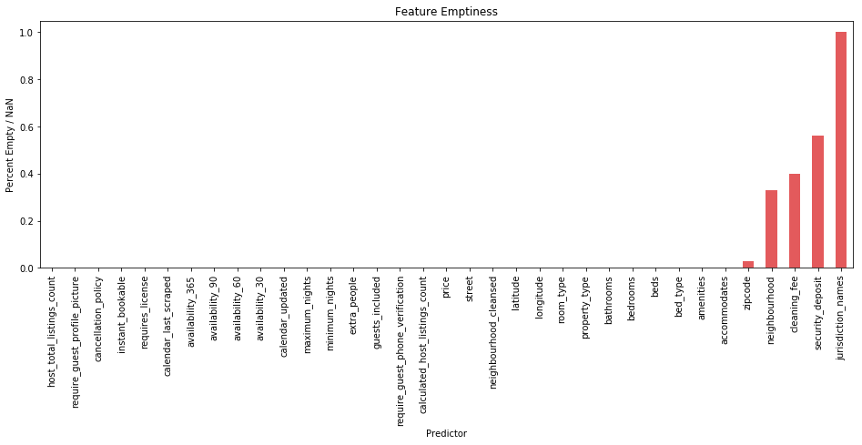

# MODELLING AIRBNB PRICES IN LONDON
Modelling Airbnb prices in London using different Machine Learning models:
* Random Forest
* Gradient Boosting
* Neural Network


# Data Preprocessing


```python
import random
random.seed(42)
```

## Import data


```python
# Import data

import pandas as pd

main_file_path = 'listings.csv' 
data = pd.read_csv(main_file_path, low_memory=False)

print(data.columns)
```

    Index(['id', 'listing_url', 'scrape_id', 'last_scraped', 'name', 'summary',
           'space', 'description', 'experiences_offered', 'neighborhood_overview',
           'notes', 'transit', 'access', 'interaction', 'house_rules',
           'thumbnail_url', 'medium_url', 'picture_url', 'xl_picture_url',
           'host_id', 'host_url', 'host_name', 'host_since', 'host_location',
           'host_about', 'host_response_time', 'host_response_rate',
           'host_acceptance_rate', 'host_is_superhost', 'host_thumbnail_url',
           'host_picture_url', 'host_neighbourhood', 'host_listings_count',
           'host_total_listings_count', 'host_verifications',
           'host_has_profile_pic', 'host_identity_verified', 'street',
           'neighbourhood', 'neighbourhood_cleansed',
           'neighbourhood_group_cleansed', 'city', 'state', 'zipcode', 'market',
           'smart_location', 'country_code', 'country', 'latitude', 'longitude',
           'is_location_exact', 'property_type', 'room_type', 'accommodates',
           'bathrooms', 'bedrooms', 'beds', 'bed_type', 'amenities', 'square_feet',
           'price', 'weekly_price', 'monthly_price', 'security_deposit',
           'cleaning_fee', 'guests_included', 'extra_people', 'minimum_nights',
           'maximum_nights', 'calendar_updated', 'has_availability',
           'availability_30', 'availability_60', 'availability_90',
           'availability_365', 'calendar_last_scraped', 'number_of_reviews',
           'first_review', 'last_review', 'review_scores_rating',
           'review_scores_accuracy', 'review_scores_cleanliness',
           'review_scores_checkin', 'review_scores_communication',
           'review_scores_location', 'review_scores_value', 'requires_license',
           'license', 'jurisdiction_names', 'instant_bookable',
           'cancellation_policy', 'require_guest_profile_picture',
           'require_guest_phone_verification', 'calculated_host_listings_count',
           'reviews_per_month'],
          dtype='object')
    


```python
print(data.shape)
```

    (53904, 95)
    

## Feature Selection

### Initial selection - Drop useless features


```python
useless = ['id', 'listing_url', 'scrape_id', 'last_scraped', 'name', 'summary',
       'space', 'description', 'experiences_offered', 'neighborhood_overview',
       'notes', 'transit', 'access', 'interaction', 'house_rules',
       'thumbnail_url', 'medium_url', 'picture_url', 'xl_picture_url',
       'host_id', 'host_url', 'host_name', 'host_since', 'host_location',
       'host_about', 'host_response_time', 'host_response_rate',
       'host_acceptance_rate', 'host_is_superhost', 'host_thumbnail_url',
       'host_picture_url', 'host_neighbourhood', 'host_listings_count',
       'host_verifications', 'host_has_profile_pic', 'host_identity_verified',
       'city', 'state', 'market', 'smart_location', 'country_code', 'country',
       'is_location_exact', 'weekly_price', 'monthly_price']
data.drop(useless, axis=1, inplace=True)
```


```python
# Drop reviews features as they are not available for new apartments in Airbnb
useless = ['number_of_reviews', 'first_review', 'last_review', 'review_scores_rating',
           'review_scores_accuracy', 'review_scores_cleanliness',
           'review_scores_checkin', 'review_scores_communication',
           'review_scores_location', 'review_scores_value', 'reviews_per_month']
data.drop(useless, axis=1, inplace=True)
```


```python
print(data.shape)
```

    (53904, 39)
    

### Selection on numerical data


```python
data.describe()
```


<div>
<style scoped>
    .dataframe tbody tr th:only-of-type {
        vertical-align: middle;
    }

    .dataframe tbody tr th {
        vertical-align: top;
    }

    .dataframe thead th {
        text-align: right;
    }
</style>
<table border="1" class="dataframe">
  <thead>
    <tr style="text-align: right;">
      <th></th>
      <th>host_total_listings_count</th>
      <th>neighbourhood_group_cleansed</th>
      <th>latitude</th>
      <th>longitude</th>
      <th>accommodates</th>
      <th>bathrooms</th>
      <th>bedrooms</th>
      <th>beds</th>
      <th>square_feet</th>
      <th>guests_included</th>
      <th>minimum_nights</th>
      <th>maximum_nights</th>
      <th>has_availability</th>
      <th>availability_30</th>
      <th>availability_60</th>
      <th>availability_90</th>
      <th>availability_365</th>
      <th>license</th>
      <th>calculated_host_listings_count</th>
    </tr>
  </thead>
  <tbody>
    <tr>
      <th>count</th>
      <td>53895.000000</td>
      <td>0.0</td>
      <td>53904.000000</td>
      <td>53904.000000</td>
      <td>53904.000000</td>
      <td>53644.000000</td>
      <td>53811.000000</td>
      <td>53731.000000</td>
      <td>582.000000</td>
      <td>53904.000000</td>
      <td>53904.000000</td>
      <td>5.390400e+04</td>
      <td>0.0</td>
      <td>53904.000000</td>
      <td>53904.000000</td>
      <td>53904.000000</td>
      <td>53904.000000</td>
      <td>0.0</td>
      <td>53904.000000</td>
    </tr>
    <tr>
      <th>mean</th>
      <td>15.885500</td>
      <td>NaN</td>
      <td>51.510425</td>
      <td>-0.127105</td>
      <td>3.036676</td>
      <td>1.262751</td>
      <td>1.353980</td>
      <td>1.708027</td>
      <td>577.508591</td>
      <td>1.407428</td>
      <td>3.285229</td>
      <td>2.683750e+05</td>
      <td>NaN</td>
      <td>11.830755</td>
      <td>25.337674</td>
      <td>40.514433</td>
      <td>155.849789</td>
      <td>NaN</td>
      <td>14.976106</td>
    </tr>
    <tr>
      <th>std</th>
      <td>84.700442</td>
      <td>NaN</td>
      <td>0.045454</td>
      <td>0.088346</td>
      <td>1.907429</td>
      <td>0.547699</td>
      <td>0.841912</td>
      <td>1.201165</td>
      <td>726.154243</td>
      <td>1.040308</td>
      <td>28.536837</td>
      <td>2.317162e+07</td>
      <td>NaN</td>
      <td>12.178077</td>
      <td>24.064923</td>
      <td>36.383218</td>
      <td>144.032928</td>
      <td>NaN</td>
      <td>81.750305</td>
    </tr>
    <tr>
      <th>min</th>
      <td>0.000000</td>
      <td>NaN</td>
      <td>51.292892</td>
      <td>-0.501305</td>
      <td>1.000000</td>
      <td>0.000000</td>
      <td>0.000000</td>
      <td>0.000000</td>
      <td>0.000000</td>
      <td>1.000000</td>
      <td>1.000000</td>
      <td>1.000000e+00</td>
      <td>NaN</td>
      <td>0.000000</td>
      <td>0.000000</td>
      <td>0.000000</td>
      <td>0.000000</td>
      <td>NaN</td>
      <td>1.000000</td>
    </tr>
    <tr>
      <th>25%</th>
      <td>1.000000</td>
      <td>NaN</td>
      <td>51.485099</td>
      <td>-0.187191</td>
      <td>2.000000</td>
      <td>1.000000</td>
      <td>1.000000</td>
      <td>1.000000</td>
      <td>108.000000</td>
      <td>1.000000</td>
      <td>1.000000</td>
      <td>6.000000e+01</td>
      <td>NaN</td>
      <td>0.000000</td>
      <td>0.000000</td>
      <td>0.000000</td>
      <td>9.000000</td>
      <td>NaN</td>
      <td>1.000000</td>
    </tr>
    <tr>
      <th>50%</th>
      <td>1.000000</td>
      <td>NaN</td>
      <td>51.514730</td>
      <td>-0.122403</td>
      <td>2.000000</td>
      <td>1.000000</td>
      <td>1.000000</td>
      <td>1.000000</td>
      <td>484.000000</td>
      <td>1.000000</td>
      <td>2.000000</td>
      <td>1.125000e+03</td>
      <td>NaN</td>
      <td>8.000000</td>
      <td>20.000000</td>
      <td>36.000000</td>
      <td>92.000000</td>
      <td>NaN</td>
      <td>1.000000</td>
    </tr>
    <tr>
      <th>75%</th>
      <td>3.000000</td>
      <td>NaN</td>
      <td>51.538943</td>
      <td>-0.069183</td>
      <td>4.000000</td>
      <td>1.500000</td>
      <td>2.000000</td>
      <td>2.000000</td>
      <td>819.500000</td>
      <td>1.000000</td>
      <td>3.000000</td>
      <td>1.125000e+03</td>
      <td>NaN</td>
      <td>26.000000</td>
      <td>53.000000</td>
      <td>81.000000</td>
      <td>321.000000</td>
      <td>NaN</td>
      <td>3.000000</td>
    </tr>
    <tr>
      <th>max</th>
      <td>735.000000</td>
      <td>NaN</td>
      <td>51.683101</td>
      <td>0.317523</td>
      <td>16.000000</td>
      <td>8.000000</td>
      <td>10.000000</td>
      <td>16.000000</td>
      <td>10710.000000</td>
      <td>16.000000</td>
      <td>5000.000000</td>
      <td>2.147484e+09</td>
      <td>NaN</td>
      <td>30.000000</td>
      <td>60.000000</td>
      <td>90.000000</td>
      <td>365.000000</td>
      <td>NaN</td>
      <td>711.000000</td>
    </tr>
  </tbody>
</table>
</div>


```python
# Drop count = 0 and count < 600 (square_feet)
useless = ['neighbourhood_group_cleansed', 'license', 'has_availability', 'square_feet']
data.drop(useless, axis=1, inplace=True)
```


```python
print(data.shape)
```

    (53904, 35)
    

### Feature Emptiness


```python
import matplotlib.pyplot as plt

def percent_empty(df):
    
    bools = df.isnull().tolist()
    percent_empty = float(bools.count(True)) / float(len(bools))
    
    return percent_empty, float(bools.count(True))

# Store emptiness for all features
emptiness = []

missing_columns = []

# Get emptiness for all features
for i in range(0, data.shape[1]):
    p, n = percent_empty(data.iloc[:,i])
    if n > 0:
        missing_columns.append(data.columns.values[i])
    emptiness.append(round((p), 2))
    
empty_dict = dict(zip(data.columns.values.tolist(), emptiness))

# Plot emptiness graph
empty = pd.DataFrame.from_dict(empty_dict, orient = 'index').sort_values(by=0)
ax = empty.plot(kind = 'bar', color='#E35A5C', figsize = (16, 5))
ax.set_xlabel('Predictor')
ax.set_ylabel('Percent Empty / NaN')
ax.set_title('Feature Emptiness')
ax.legend_.remove()

plt.show()
```





```python
# Drop neighbourhood, cleaning_fee, security_deposit and juridisction_names
useless = ['neighbourhood', 'cleaning_fee', 'security_deposit', 'jurisdiction_names']
data.drop(useless, axis=1, inplace=True)
```

### Selection on categorical data


```python
data.head()
```


<div>
<style scoped>
    .dataframe tbody tr th:only-of-type {
        vertical-align: middle;
    }

    .dataframe tbody tr th {
        vertical-align: top;
    }

    .dataframe thead th {
        text-align: right;
    }
</style>
<table border="1" class="dataframe">
  <thead>
    <tr style="text-align: right;">
      <th></th>
      <th>host_total_listings_count</th>
      <th>street</th>
      <th>neighbourhood_cleansed</th>
      <th>zipcode</th>
      <th>latitude</th>
      <th>longitude</th>
      <th>property_type</th>
      <th>room_type</th>
      <th>accommodates</th>
      <th>bathrooms</th>
      <th>...</th>
      <th>availability_60</th>
      <th>availability_90</th>
      <th>availability_365</th>
      <th>calendar_last_scraped</th>
      <th>requires_license</th>
      <th>instant_bookable</th>
      <th>cancellation_policy</th>
      <th>require_guest_profile_picture</th>
      <th>require_guest_phone_verification</th>
      <th>calculated_host_listings_count</th>
    </tr>
  </thead>
  <tbody>
    <tr>
      <th>0</th>
      <td>1.0</td>
      <td>A Thames Street, Kingston upon Thames, England...</td>
      <td>Kingston upon Thames</td>
      <td>KT1 1PE</td>
      <td>51.410036</td>
      <td>-0.306323</td>
      <td>Apartment</td>
      <td>Private room</td>
      <td>1</td>
      <td>1.0</td>
      <td>...</td>
      <td>31</td>
      <td>61</td>
      <td>61</td>
      <td>2017-03-05</td>
      <td>f</td>
      <td>f</td>
      <td>flexible</td>
      <td>f</td>
      <td>f</td>
      <td>1</td>
    </tr>
    <tr>
      <th>1</th>
      <td>1.0</td>
      <td>London Road, Kingston upon Thames, Greater Lon...</td>
      <td>Kingston upon Thames</td>
      <td>KT2 6QS</td>
      <td>51.411482</td>
      <td>-0.290704</td>
      <td>Apartment</td>
      <td>Private room</td>
      <td>2</td>
      <td>1.0</td>
      <td>...</td>
      <td>59</td>
      <td>89</td>
      <td>364</td>
      <td>2017-03-04</td>
      <td>f</td>
      <td>f</td>
      <td>moderate</td>
      <td>f</td>
      <td>f</td>
      <td>1</td>
    </tr>
    <tr>
      <th>2</th>
      <td>1.0</td>
      <td>Kingston Hill, Kingston upon Thames, KT2 7PW, ...</td>
      <td>Kingston upon Thames</td>
      <td>KT2 7PW</td>
      <td>51.415851</td>
      <td>-0.286496</td>
      <td>Apartment</td>
      <td>Private room</td>
      <td>2</td>
      <td>1.0</td>
      <td>...</td>
      <td>0</td>
      <td>0</td>
      <td>0</td>
      <td>2017-03-05</td>
      <td>f</td>
      <td>f</td>
      <td>flexible</td>
      <td>f</td>
      <td>f</td>
      <td>1</td>
    </tr>
    <tr>
      <th>3</th>
      <td>1.0</td>
      <td>Canbury Avenue, Kingston upon Thames, KT2 6JR,...</td>
      <td>Kingston upon Thames</td>
      <td>KT2 6JR</td>
      <td>51.415723</td>
      <td>-0.292246</td>
      <td>House</td>
      <td>Private room</td>
      <td>2</td>
      <td>1.5</td>
      <td>...</td>
      <td>0</td>
      <td>0</td>
      <td>0</td>
      <td>2017-03-05</td>
      <td>f</td>
      <td>f</td>
      <td>flexible</td>
      <td>f</td>
      <td>f</td>
      <td>1</td>
    </tr>
    <tr>
      <th>4</th>
      <td>1.0</td>
      <td>Kingston Road, New Malden, England KT3 3RX, Un...</td>
      <td>Kingston upon Thames</td>
      <td>KT3 3RX</td>
      <td>51.404285</td>
      <td>-0.275426</td>
      <td>House</td>
      <td>Private room</td>
      <td>1</td>
      <td>1.0</td>
      <td>...</td>
      <td>59</td>
      <td>89</td>
      <td>179</td>
      <td>2017-03-05</td>
      <td>f</td>
      <td>f</td>
      <td>flexible</td>
      <td>f</td>
      <td>f</td>
      <td>1</td>
    </tr>
  </tbody>
</table>
<p>5 rows × 31 columns</p>
</div>


```python
# Drop street as we have enought localisation info (redundant)
# Drop calendar_last_scraped and calendar_updated (date)

useless = ['street', 'calendar_last_scraped', 'calendar_updated']
data.drop(useless, axis=1, inplace=True)
```

### Examine multicollinearity


```python
import numpy as np
from sklearn import preprocessing

# Function to label encode categorical variables.
# Input: array (array of values)
# Output: array (array of encoded values)
def encode_categorical(array):
    if not array.dtype == np.dtype('float64'):
        return preprocessing.LabelEncoder().fit_transform(array) 
    else:
        return array
    
# Temporary dataframe
temp_data = data.copy()
# Delete additional entries with NaN values
temp_data = temp_data.dropna(axis=0)

# Encode categorical data
temp_data = temp_data.apply(encode_categorical)
# Compute matrix of correlation coefficients
corr_matrix = np.corrcoef(temp_data.T)

corr_df = pd.DataFrame(data = corr_matrix, columns = temp_data.columns, 
             index = temp_data.columns)

corr_df
```

    C:\Users\cbarret\AppData\Local\Continuum\anaconda3\lib\site-packages\numpy\lib\function_base.py:3183: RuntimeWarning: invalid value encountered in true_divide
      c /= stddev[:, None]
    C:\Users\cbarret\AppData\Local\Continuum\anaconda3\lib\site-packages\numpy\lib\function_base.py:3184: RuntimeWarning: invalid value encountered in true_divide
      c /= stddev[None, :]
    


<div>
<style scoped>
    .dataframe tbody tr th:only-of-type {
        vertical-align: middle;
    }

    .dataframe tbody tr th {
        vertical-align: top;
    }

    .dataframe thead th {
        text-align: right;
    }
</style>
<table border="1" class="dataframe">
  <thead>
    <tr style="text-align: right;">
      <th></th>
      <th>host_total_listings_count</th>
      <th>neighbourhood_cleansed</th>
      <th>zipcode</th>
      <th>latitude</th>
      <th>longitude</th>
      <th>property_type</th>
      <th>room_type</th>
      <th>accommodates</th>
      <th>bathrooms</th>
      <th>bedrooms</th>
      <th>...</th>
      <th>availability_30</th>
      <th>availability_60</th>
      <th>availability_90</th>
      <th>availability_365</th>
      <th>requires_license</th>
      <th>instant_bookable</th>
      <th>cancellation_policy</th>
      <th>require_guest_profile_picture</th>
      <th>require_guest_phone_verification</th>
      <th>calculated_host_listings_count</th>
    </tr>
  </thead>
  <tbody>
    <tr>
      <th>host_total_listings_count</th>
      <td>1.000000</td>
      <td>-0.005127</td>
      <td>0.050687</td>
      <td>-0.011036</td>
      <td>-0.055431</td>
      <td>0.050730</td>
      <td>-0.132410</td>
      <td>0.195332</td>
      <td>0.161109</td>
      <td>0.204254</td>
      <td>...</td>
      <td>-0.063743</td>
      <td>-0.073213</td>
      <td>-0.079564</td>
      <td>-0.074616</td>
      <td>NaN</td>
      <td>0.140389</td>
      <td>0.163160</td>
      <td>-0.016055</td>
      <td>0.005980</td>
      <td>0.671924</td>
    </tr>
    <tr>
      <th>neighbourhood_cleansed</th>
      <td>-0.005127</td>
      <td>1.000000</td>
      <td>0.084137</td>
      <td>-0.293614</td>
      <td>0.146554</td>
      <td>-0.082953</td>
      <td>-0.023419</td>
      <td>0.031375</td>
      <td>0.007960</td>
      <td>-0.000187</td>
      <td>...</td>
      <td>-0.023684</td>
      <td>-0.030654</td>
      <td>-0.030093</td>
      <td>-0.025278</td>
      <td>NaN</td>
      <td>0.014061</td>
      <td>0.054646</td>
      <td>0.003149</td>
      <td>0.003697</td>
      <td>0.039817</td>
    </tr>
    <tr>
      <th>zipcode</th>
      <td>0.050687</td>
      <td>0.084137</td>
      <td>1.000000</td>
      <td>-0.353730</td>
      <td>-0.565879</td>
      <td>-0.044483</td>
      <td>-0.132562</td>
      <td>0.077738</td>
      <td>0.038776</td>
      <td>0.053252</td>
      <td>...</td>
      <td>-0.015046</td>
      <td>-0.020062</td>
      <td>-0.020715</td>
      <td>0.002121</td>
      <td>NaN</td>
      <td>-0.000359</td>
      <td>0.060454</td>
      <td>-0.016513</td>
      <td>0.009826</td>
      <td>0.023995</td>
    </tr>
    <tr>
      <th>latitude</th>
      <td>-0.011036</td>
      <td>-0.293614</td>
      <td>-0.353730</td>
      <td>1.000000</td>
      <td>0.120343</td>
      <td>-0.033812</td>
      <td>0.007060</td>
      <td>-0.015904</td>
      <td>-0.017905</td>
      <td>-0.034437</td>
      <td>...</td>
      <td>-0.025690</td>
      <td>-0.025189</td>
      <td>-0.023941</td>
      <td>-0.017151</td>
      <td>NaN</td>
      <td>0.007672</td>
      <td>0.012145</td>
      <td>0.008580</td>
      <td>0.000991</td>
      <td>0.010230</td>
    </tr>
    <tr>
      <th>longitude</th>
      <td>-0.055431</td>
      <td>0.146554</td>
      <td>-0.565879</td>
      <td>0.120343</td>
      <td>1.000000</td>
      <td>-0.008618</td>
      <td>0.075391</td>
      <td>-0.039736</td>
      <td>-0.041380</td>
      <td>-0.047912</td>
      <td>...</td>
      <td>-0.010266</td>
      <td>-0.011065</td>
      <td>-0.008517</td>
      <td>-0.011563</td>
      <td>NaN</td>
      <td>-0.009358</td>
      <td>-0.008436</td>
      <td>0.013843</td>
      <td>0.002497</td>
      <td>-0.022036</td>
    </tr>
    <tr>
      <th>property_type</th>
      <td>0.050730</td>
      <td>-0.082953</td>
      <td>-0.044483</td>
      <td>-0.033812</td>
      <td>-0.008618</td>
      <td>1.000000</td>
      <td>0.220069</td>
      <td>0.043787</td>
      <td>0.227840</td>
      <td>0.178872</td>
      <td>...</td>
      <td>0.057587</td>
      <td>0.065528</td>
      <td>0.061938</td>
      <td>0.048798</td>
      <td>NaN</td>
      <td>0.013879</td>
      <td>-0.087747</td>
      <td>0.009324</td>
      <td>-0.015797</td>
      <td>-0.049072</td>
    </tr>
    <tr>
      <th>room_type</th>
      <td>-0.132410</td>
      <td>-0.023419</td>
      <td>-0.132562</td>
      <td>0.007060</td>
      <td>0.075391</td>
      <td>0.220069</td>
      <td>1.000000</td>
      <td>-0.556203</td>
      <td>-0.137473</td>
      <td>-0.379841</td>
      <td>...</td>
      <td>0.203921</td>
      <td>0.224803</td>
      <td>0.226273</td>
      <td>0.159139</td>
      <td>NaN</td>
      <td>0.033986</td>
      <td>-0.235518</td>
      <td>0.010476</td>
      <td>-0.036735</td>
      <td>-0.149386</td>
    </tr>
    <tr>
      <th>accommodates</th>
      <td>0.195332</td>
      <td>0.031375</td>
      <td>0.077738</td>
      <td>-0.015904</td>
      <td>-0.039736</td>
      <td>0.043787</td>
      <td>-0.556203</td>
      <td>1.000000</td>
      <td>0.461153</td>
      <td>0.759001</td>
      <td>...</td>
      <td>-0.080867</td>
      <td>-0.111742</td>
      <td>-0.111240</td>
      <td>-0.043868</td>
      <td>NaN</td>
      <td>0.035346</td>
      <td>0.245741</td>
      <td>-0.001915</td>
      <td>0.054846</td>
      <td>0.200445</td>
    </tr>
    <tr>
      <th>bathrooms</th>
      <td>0.161109</td>
      <td>0.007960</td>
      <td>0.038776</td>
      <td>-0.017905</td>
      <td>-0.041380</td>
      <td>0.227840</td>
      <td>-0.137473</td>
      <td>0.461153</td>
      <td>1.000000</td>
      <td>0.541303</td>
      <td>...</td>
      <td>-0.016593</td>
      <td>-0.023303</td>
      <td>-0.028161</td>
      <td>-0.016261</td>
      <td>NaN</td>
      <td>0.003375</td>
      <td>0.088682</td>
      <td>-0.016850</td>
      <td>0.003724</td>
      <td>0.125102</td>
    </tr>
    <tr>
      <th>bedrooms</th>
      <td>0.204254</td>
      <td>-0.000187</td>
      <td>0.053252</td>
      <td>-0.034437</td>
      <td>-0.047912</td>
      <td>0.178872</td>
      <td>-0.379841</td>
      <td>0.759001</td>
      <td>0.541303</td>
      <td>1.000000</td>
      <td>...</td>
      <td>-0.080191</td>
      <td>-0.100395</td>
      <td>-0.106722</td>
      <td>-0.077040</td>
      <td>NaN</td>
      <td>-0.034450</td>
      <td>0.132544</td>
      <td>-0.013254</td>
      <td>0.017472</td>
      <td>0.117977</td>
    </tr>
    <tr>
      <th>beds</th>
      <td>0.170156</td>
      <td>0.004972</td>
      <td>0.064368</td>
      <td>-0.018223</td>
      <td>-0.050774</td>
      <td>0.128090</td>
      <td>-0.391487</td>
      <td>0.827972</td>
      <td>0.488144</td>
      <td>0.740181</td>
      <td>...</td>
      <td>-0.054729</td>
      <td>-0.077579</td>
      <td>-0.080258</td>
      <td>-0.024254</td>
      <td>NaN</td>
      <td>0.018253</td>
      <td>0.183895</td>
      <td>-0.003570</td>
      <td>0.032191</td>
      <td>0.148290</td>
    </tr>
    <tr>
      <th>bed_type</th>
      <td>0.016338</td>
      <td>0.012216</td>
      <td>0.010687</td>
      <td>0.000465</td>
      <td>-0.000476</td>
      <td>0.000325</td>
      <td>-0.081406</td>
      <td>0.059158</td>
      <td>0.043690</td>
      <td>0.057910</td>
      <td>...</td>
      <td>-0.024540</td>
      <td>-0.026255</td>
      <td>-0.024303</td>
      <td>-0.021154</td>
      <td>NaN</td>
      <td>0.024360</td>
      <td>0.026778</td>
      <td>-0.000277</td>
      <td>0.002826</td>
      <td>0.026745</td>
    </tr>
    <tr>
      <th>amenities</th>
      <td>0.119517</td>
      <td>0.015600</td>
      <td>0.095156</td>
      <td>-0.057969</td>
      <td>-0.065238</td>
      <td>-0.033067</td>
      <td>-0.227787</td>
      <td>0.180811</td>
      <td>0.075295</td>
      <td>0.134877</td>
      <td>...</td>
      <td>-0.002852</td>
      <td>-0.011966</td>
      <td>-0.013252</td>
      <td>0.025671</td>
      <td>NaN</td>
      <td>-0.019060</td>
      <td>0.084349</td>
      <td>0.002577</td>
      <td>0.018745</td>
      <td>0.097607</td>
    </tr>
    <tr>
      <th>price</th>
      <td>-0.065307</td>
      <td>-0.017838</td>
      <td>-0.043446</td>
      <td>0.001855</td>
      <td>0.003258</td>
      <td>-0.040528</td>
      <td>0.165493</td>
      <td>-0.244175</td>
      <td>-0.156198</td>
      <td>-0.263388</td>
      <td>...</td>
      <td>0.005821</td>
      <td>0.011905</td>
      <td>0.011075</td>
      <td>-0.003005</td>
      <td>NaN</td>
      <td>0.012578</td>
      <td>-0.093088</td>
      <td>-0.002282</td>
      <td>-0.026094</td>
      <td>-0.102309</td>
    </tr>
    <tr>
      <th>guests_included</th>
      <td>-0.027380</td>
      <td>0.016756</td>
      <td>0.016091</td>
      <td>0.010054</td>
      <td>0.003717</td>
      <td>-0.013773</td>
      <td>-0.292390</td>
      <td>0.482275</td>
      <td>0.199668</td>
      <td>0.350701</td>
      <td>...</td>
      <td>-0.023556</td>
      <td>-0.037330</td>
      <td>-0.034143</td>
      <td>0.019060</td>
      <td>NaN</td>
      <td>-0.017707</td>
      <td>0.202397</td>
      <td>0.020016</td>
      <td>0.092158</td>
      <td>0.066126</td>
    </tr>
    <tr>
      <th>extra_people</th>
      <td>-0.055205</td>
      <td>0.009885</td>
      <td>0.001875</td>
      <td>-0.002101</td>
      <td>0.012105</td>
      <td>0.003102</td>
      <td>0.009277</td>
      <td>0.084708</td>
      <td>0.016198</td>
      <td>0.013394</td>
      <td>...</td>
      <td>0.065946</td>
      <td>0.073865</td>
      <td>0.078449</td>
      <td>0.092247</td>
      <td>NaN</td>
      <td>-0.005758</td>
      <td>0.123764</td>
      <td>0.039010</td>
      <td>0.050920</td>
      <td>-0.030162</td>
    </tr>
    <tr>
      <th>minimum_nights</th>
      <td>0.027788</td>
      <td>-0.003880</td>
      <td>0.012237</td>
      <td>0.017819</td>
      <td>-0.002467</td>
      <td>-0.014930</td>
      <td>-0.119807</td>
      <td>0.051349</td>
      <td>0.042419</td>
      <td>0.078758</td>
      <td>...</td>
      <td>-0.052958</td>
      <td>-0.047834</td>
      <td>-0.047916</td>
      <td>-0.039966</td>
      <td>NaN</td>
      <td>-0.028474</td>
      <td>0.077621</td>
      <td>0.002801</td>
      <td>0.001800</td>
      <td>0.022249</td>
    </tr>
    <tr>
      <th>maximum_nights</th>
      <td>0.099920</td>
      <td>0.017130</td>
      <td>0.026816</td>
      <td>0.001950</td>
      <td>-0.018767</td>
      <td>-0.041234</td>
      <td>-0.060543</td>
      <td>0.072027</td>
      <td>0.023965</td>
      <td>0.024387</td>
      <td>...</td>
      <td>0.008298</td>
      <td>-0.000542</td>
      <td>-0.002412</td>
      <td>0.091656</td>
      <td>NaN</td>
      <td>-0.000193</td>
      <td>0.067330</td>
      <td>-0.047798</td>
      <td>-0.040536</td>
      <td>0.166158</td>
    </tr>
    <tr>
      <th>availability_30</th>
      <td>-0.063743</td>
      <td>-0.023684</td>
      <td>-0.015046</td>
      <td>-0.025690</td>
      <td>-0.010266</td>
      <td>0.057587</td>
      <td>0.203921</td>
      <td>-0.080867</td>
      <td>-0.016593</td>
      <td>-0.080191</td>
      <td>...</td>
      <td>1.000000</td>
      <td>0.952559</td>
      <td>0.911691</td>
      <td>0.665003</td>
      <td>NaN</td>
      <td>-0.041590</td>
      <td>-0.007153</td>
      <td>0.028802</td>
      <td>0.022638</td>
      <td>0.023845</td>
    </tr>
    <tr>
      <th>availability_60</th>
      <td>-0.073213</td>
      <td>-0.030654</td>
      <td>-0.020062</td>
      <td>-0.025189</td>
      <td>-0.011065</td>
      <td>0.065528</td>
      <td>0.224803</td>
      <td>-0.111742</td>
      <td>-0.023303</td>
      <td>-0.100395</td>
      <td>...</td>
      <td>0.952559</td>
      <td>1.000000</td>
      <td>0.979338</td>
      <td>0.716228</td>
      <td>NaN</td>
      <td>-0.042256</td>
      <td>-0.003164</td>
      <td>0.034381</td>
      <td>0.026072</td>
      <td>0.018273</td>
    </tr>
    <tr>
      <th>availability_90</th>
      <td>-0.079564</td>
      <td>-0.030093</td>
      <td>-0.020715</td>
      <td>-0.023941</td>
      <td>-0.008517</td>
      <td>0.061938</td>
      <td>0.226273</td>
      <td>-0.111240</td>
      <td>-0.028161</td>
      <td>-0.106722</td>
      <td>...</td>
      <td>0.911691</td>
      <td>0.979338</td>
      <td>1.000000</td>
      <td>0.743286</td>
      <td>NaN</td>
      <td>-0.033726</td>
      <td>0.005551</td>
      <td>0.038498</td>
      <td>0.032304</td>
      <td>0.023152</td>
    </tr>
    <tr>
      <th>availability_365</th>
      <td>-0.074616</td>
      <td>-0.025278</td>
      <td>0.002121</td>
      <td>-0.017151</td>
      <td>-0.011563</td>
      <td>0.048798</td>
      <td>0.159139</td>
      <td>-0.043868</td>
      <td>-0.016261</td>
      <td>-0.077040</td>
      <td>...</td>
      <td>0.665003</td>
      <td>0.716228</td>
      <td>0.743286</td>
      <td>1.000000</td>
      <td>NaN</td>
      <td>-0.032249</td>
      <td>0.075471</td>
      <td>0.057268</td>
      <td>0.071553</td>
      <td>0.069007</td>
    </tr>
    <tr>
      <th>requires_license</th>
      <td>NaN</td>
      <td>NaN</td>
      <td>NaN</td>
      <td>NaN</td>
      <td>NaN</td>
      <td>NaN</td>
      <td>NaN</td>
      <td>NaN</td>
      <td>NaN</td>
      <td>NaN</td>
      <td>...</td>
      <td>NaN</td>
      <td>NaN</td>
      <td>NaN</td>
      <td>NaN</td>
      <td>NaN</td>
      <td>NaN</td>
      <td>NaN</td>
      <td>NaN</td>
      <td>NaN</td>
      <td>NaN</td>
    </tr>
    <tr>
      <th>instant_bookable</th>
      <td>0.140389</td>
      <td>0.014061</td>
      <td>-0.000359</td>
      <td>0.007672</td>
      <td>-0.009358</td>
      <td>0.013879</td>
      <td>0.033986</td>
      <td>0.035346</td>
      <td>0.003375</td>
      <td>-0.034450</td>
      <td>...</td>
      <td>-0.041590</td>
      <td>-0.042256</td>
      <td>-0.033726</td>
      <td>-0.032249</td>
      <td>NaN</td>
      <td>1.000000</td>
      <td>0.040202</td>
      <td>-0.000238</td>
      <td>-0.012968</td>
      <td>0.186791</td>
    </tr>
    <tr>
      <th>cancellation_policy</th>
      <td>0.163160</td>
      <td>0.054646</td>
      <td>0.060454</td>
      <td>0.012145</td>
      <td>-0.008436</td>
      <td>-0.087747</td>
      <td>-0.235518</td>
      <td>0.245741</td>
      <td>0.088682</td>
      <td>0.132544</td>
      <td>...</td>
      <td>-0.007153</td>
      <td>-0.003164</td>
      <td>0.005551</td>
      <td>0.075471</td>
      <td>NaN</td>
      <td>0.040202</td>
      <td>1.000000</td>
      <td>0.069861</td>
      <td>0.109349</td>
      <td>0.269957</td>
    </tr>
    <tr>
      <th>require_guest_profile_picture</th>
      <td>-0.016055</td>
      <td>0.003149</td>
      <td>-0.016513</td>
      <td>0.008580</td>
      <td>0.013843</td>
      <td>0.009324</td>
      <td>0.010476</td>
      <td>-0.001915</td>
      <td>-0.016850</td>
      <td>-0.013254</td>
      <td>...</td>
      <td>0.028802</td>
      <td>0.034381</td>
      <td>0.038498</td>
      <td>0.057268</td>
      <td>NaN</td>
      <td>-0.000238</td>
      <td>0.069861</td>
      <td>1.000000</td>
      <td>0.690560</td>
      <td>-0.004924</td>
    </tr>
    <tr>
      <th>require_guest_phone_verification</th>
      <td>0.005980</td>
      <td>0.003697</td>
      <td>0.009826</td>
      <td>0.000991</td>
      <td>0.002497</td>
      <td>-0.015797</td>
      <td>-0.036735</td>
      <td>0.054846</td>
      <td>0.003724</td>
      <td>0.017472</td>
      <td>...</td>
      <td>0.022638</td>
      <td>0.026072</td>
      <td>0.032304</td>
      <td>0.071553</td>
      <td>NaN</td>
      <td>-0.012968</td>
      <td>0.109349</td>
      <td>0.690560</td>
      <td>1.000000</td>
      <td>0.103778</td>
    </tr>
    <tr>
      <th>calculated_host_listings_count</th>
      <td>0.671924</td>
      <td>0.039817</td>
      <td>0.023995</td>
      <td>0.010230</td>
      <td>-0.022036</td>
      <td>-0.049072</td>
      <td>-0.149386</td>
      <td>0.200445</td>
      <td>0.125102</td>
      <td>0.117977</td>
      <td>...</td>
      <td>0.023845</td>
      <td>0.018273</td>
      <td>0.023152</td>
      <td>0.069007</td>
      <td>NaN</td>
      <td>0.186791</td>
      <td>0.269957</td>
      <td>-0.004924</td>
      <td>0.103778</td>
      <td>1.000000</td>
    </tr>
  </tbody>
</table>
<p>28 rows × 28 columns</p>
</div>


```python
import matplotlib.pyplot as plt

# Display heat map 
plt.figure(figsize=(7, 7))
plt.pcolor(corr_matrix, cmap='RdBu')
plt.xlabel('Predictor Index')
plt.ylabel('Predictor Index')
plt.title('Heatmap of Correlation Matrix')
plt.colorbar()

plt.show()
```


```python
# Drop calculated_host_listings_count as correlated with host_total_listings_count
# Keep availability_365 as availability variables are correlated with each other and this one is less correlated with other variables
# Drop requires_license (weird correlation result and won't impact the results)

useless = ['calculated_host_listings_count', 'availability_30', 'availability_60', 'availability_90', 'requires_license']
data.drop(useless, axis=1, inplace=True)
```

## Select the 15000 first rows of the data frame


```python
data = data.iloc[0:15000, : ]
```


```python
print(data.shape)
```

    (15000, 23)
    

## Manipulation on price column --> integer


```python
# Transform price column
data['price'] = data['price'].str.replace('$', '')
data['price'] = data['price'].str.replace(',', '')
data['price'] = pd.to_numeric(data['price'])
```


```python
# Transform extra_people column
data['extra_people'] = data['extra_people'].str.replace('$', '')
data['extra_people'] = data['extra_people'].str.replace(',', '')
data['extra_people'] = pd.to_numeric(data['extra_people'])
```


```python
from sklearn.utils import shuffle
data = shuffle(data)
```


```python
data.iloc[0:6, 0:10]
```


<div>
<style scoped>
    .dataframe tbody tr th:only-of-type {
        vertical-align: middle;
    }

    .dataframe tbody tr th {
        vertical-align: top;
    }

    .dataframe thead th {
        text-align: right;
    }
</style>
<table border="1" class="dataframe">
  <thead>
    <tr style="text-align: right;">
      <th></th>
      <th>host_total_listings_count</th>
      <th>neighbourhood_cleansed</th>
      <th>zipcode</th>
      <th>latitude</th>
      <th>longitude</th>
      <th>property_type</th>
      <th>room_type</th>
      <th>accommodates</th>
      <th>bathrooms</th>
      <th>bedrooms</th>
    </tr>
  </thead>
  <tbody>
    <tr>
      <th>10036</th>
      <td>6.0</td>
      <td>Lambeth</td>
      <td>SW2 3NH</td>
      <td>51.442923</td>
      <td>-0.118154</td>
      <td>Apartment</td>
      <td>Private room</td>
      <td>1</td>
      <td>1.0</td>
      <td>1.0</td>
    </tr>
    <tr>
      <th>8325</th>
      <td>2.0</td>
      <td>Lambeth</td>
      <td>SE11 5HT</td>
      <td>51.487252</td>
      <td>-0.119296</td>
      <td>Apartment</td>
      <td>Entire home/apt</td>
      <td>6</td>
      <td>1.0</td>
      <td>2.0</td>
    </tr>
    <tr>
      <th>11544</th>
      <td>2.0</td>
      <td>Southwark</td>
      <td>SE1 3NR</td>
      <td>51.496727</td>
      <td>-0.075414</td>
      <td>Apartment</td>
      <td>Entire home/apt</td>
      <td>3</td>
      <td>1.0</td>
      <td>1.0</td>
    </tr>
    <tr>
      <th>11810</th>
      <td>4.0</td>
      <td>Southwark</td>
      <td>SE17 1RL</td>
      <td>51.489426</td>
      <td>-0.094692</td>
      <td>Apartment</td>
      <td>Entire home/apt</td>
      <td>3</td>
      <td>1.0</td>
      <td>0.0</td>
    </tr>
    <tr>
      <th>4544</th>
      <td>4.0</td>
      <td>Brent</td>
      <td>NW10 5UA</td>
      <td>51.534512</td>
      <td>-0.239362</td>
      <td>Apartment</td>
      <td>Entire home/apt</td>
      <td>5</td>
      <td>1.0</td>
      <td>3.0</td>
    </tr>
    <tr>
      <th>1183</th>
      <td>2.0</td>
      <td>Bromley</td>
      <td>BR3 1QH</td>
      <td>51.417935</td>
      <td>-0.031765</td>
      <td>House</td>
      <td>Private room</td>
      <td>2</td>
      <td>2.5</td>
      <td>1.0</td>
    </tr>
  </tbody>
</table>
</div>


```python
data.iloc[0:6, 11:23]
```


<div>
<style scoped>
    .dataframe tbody tr th:only-of-type {
        vertical-align: middle;
    }

    .dataframe tbody tr th {
        vertical-align: top;
    }

    .dataframe thead th {
        text-align: right;
    }
</style>
<table border="1" class="dataframe">
  <thead>
    <tr style="text-align: right;">
      <th></th>
      <th>bed_type</th>
      <th>amenities</th>
      <th>price</th>
      <th>guests_included</th>
      <th>extra_people</th>
      <th>minimum_nights</th>
      <th>maximum_nights</th>
      <th>availability_365</th>
      <th>instant_bookable</th>
      <th>cancellation_policy</th>
      <th>require_guest_profile_picture</th>
      <th>require_guest_phone_verification</th>
    </tr>
  </thead>
  <tbody>
    <tr>
      <th>10036</th>
      <td>Real Bed</td>
      <td>{"Wireless Internet",Kitchen,Heating,Washer,"S...</td>
      <td>18.0</td>
      <td>1</td>
      <td>0.0</td>
      <td>5</td>
      <td>1125</td>
      <td>13</td>
      <td>t</td>
      <td>flexible</td>
      <td>f</td>
      <td>f</td>
    </tr>
    <tr>
      <th>8325</th>
      <td>Real Bed</td>
      <td>{TV,Internet,"Wireless Internet","Wheelchair a...</td>
      <td>189.0</td>
      <td>2</td>
      <td>20.0</td>
      <td>2</td>
      <td>1125</td>
      <td>339</td>
      <td>f</td>
      <td>strict</td>
      <td>f</td>
      <td>f</td>
    </tr>
    <tr>
      <th>11544</th>
      <td>Real Bed</td>
      <td>{Internet,Kitchen,Heating,Shampoo,"Hair dryer"...</td>
      <td>78.0</td>
      <td>2</td>
      <td>10.0</td>
      <td>5</td>
      <td>1125</td>
      <td>225</td>
      <td>f</td>
      <td>strict</td>
      <td>f</td>
      <td>f</td>
    </tr>
    <tr>
      <th>11810</th>
      <td>Real Bed</td>
      <td>{"Wireless Internet",Kitchen,Heating,"Family/k...</td>
      <td>76.0</td>
      <td>1</td>
      <td>0.0</td>
      <td>2</td>
      <td>1125</td>
      <td>291</td>
      <td>t</td>
      <td>strict</td>
      <td>f</td>
      <td>f</td>
    </tr>
    <tr>
      <th>4544</th>
      <td>Real Bed</td>
      <td>{TV,Internet,"Wireless Internet",Kitchen,Break...</td>
      <td>100.0</td>
      <td>4</td>
      <td>15.0</td>
      <td>3</td>
      <td>1125</td>
      <td>0</td>
      <td>f</td>
      <td>strict</td>
      <td>f</td>
      <td>f</td>
    </tr>
    <tr>
      <th>1183</th>
      <td>Real Bed</td>
      <td>{TV,Internet,"Wireless Internet","Wheelchair a...</td>
      <td>30.0</td>
      <td>1</td>
      <td>0.0</td>
      <td>1</td>
      <td>30</td>
      <td>20</td>
      <td>t</td>
      <td>strict</td>
      <td>f</td>
      <td>f</td>
    </tr>
  </tbody>
</table>
</div>


```python
# Delete amenities feature (too complicated to process for the moment)
data.drop(['amenities'], axis=1, inplace=True)
```


```python
print(data.shape)
```

    (15000, 22)
    

## One Hot Encoding for categorical variables 


```python
# One Hot Encoding for categorical variables
data = pd.get_dummies(data)
```

## Split the data: Features / labels and Training set / testing set


```python
# Extract features and labels
y = data['price']
X = data.drop('price', axis = 1)

# Training and Testing Sets
from sklearn.model_selection import train_test_split
train_X, test_X, train_y, test_y = train_test_split(X, y, random_state = 0)
```

## Convert to numpy arrays


```python
import numpy as np
train_X = np.array(train_X)
test_X = np.array(test_X)
train_y = np.array(train_y)
test_y = np.array(test_y)
```


```python
%store train_X
%store test_X
%store train_y
%store test_y
```

    Stored 'train_X' (ndarray)
    Stored 'test_X' (ndarray)
    Stored 'train_y' (ndarray)
    Stored 'test_y' (ndarray)
    


```python
train_X.shape, test_X.shape
```


    ((11250, 8336), (3750, 8336))


One Hot Encoding has created lots of features, so we will probably need to select the most usefull features.


# RANDOM FOREST REGRESSOR

## Without feature selection

### Create the pipeline and fit the model


```python
from sklearn.ensemble import RandomForestRegressor
from sklearn.pipeline import make_pipeline
from sklearn.preprocessing import Imputer
from sklearn.preprocessing import StandardScaler

# Create the pipeline (imputer + scaler + regressor)
my_pipeline_RF = make_pipeline(Imputer(), StandardScaler(),
                               RandomForestRegressor(random_state=42))

# Fit the model
my_pipeline_RF.fit(train_X, train_y)
```


    Pipeline(memory=None,
         steps=[('imputer', Imputer(axis=0, copy=True, missing_values='NaN', strategy='mean', verbose=0)), ('standardscaler', StandardScaler(copy=True, with_mean=True, with_std=True)), ('randomforestregressor', RandomForestRegressor(bootstrap=True, criterion='mse', max_depth=None,
               max_features='au...estimators=10, n_jobs=1,
               oob_score=False, random_state=42, verbose=0, warm_start=False))])


### Evaluate the model without feature selection

#### Results on test data


```python
# Predict prices of the test data
predictions = my_pipeline_RF.predict(test_X)

from sklearn.metrics import mean_absolute_error
# Write the MEA
print("Mean Absolute Error test: " + str(round(mean_absolute_error(predictions, test_y), 2))) 

from sklearn.metrics import mean_squared_error
# Write the MEA
print("Mean Squared Error test: " + str(round(mean_squared_error(predictions, test_y), 2))) 

from math import sqrt
RMSE = round(sqrt(mean_squared_error(predictions, test_y)), 2)
# Write the RMSE
print("RMSE test: " + str(RMSE)) 
```

    Mean Absolute Error test: 19.94
    Mean Squared Error test: 1534.51
    RMSE test: 39.17
    

#### Results on train data


```python
# Predict prices of the train data
predictions_train = my_pipeline_RF.predict(train_X)

from sklearn.metrics import mean_absolute_error
# Write the MEA
print("Mean Absolute Error train: " + str(round(mean_absolute_error(predictions_train, train_y), 2))) 

from sklearn.metrics import mean_squared_error
# Write the MEA
print("Mean Squared Error train: " + str(round(mean_squared_error(predictions_train, train_y), 2))) 

from math import sqrt
RMSE_train = round(sqrt(mean_squared_error(predictions_train, train_y)), 2)
# Write the RMSE
print("RMSE train: " + str(RMSE_train)) 
```

    Mean Absolute Error train: 8.29
    Mean Squared Error train: 1219.22
    RMSE train: 34.92
    

## With feature selection

### Create the pipeline and fit the model


```python
from sklearn.ensemble import RandomForestRegressor
from sklearn.pipeline import make_pipeline
from sklearn.preprocessing import Imputer
from sklearn.preprocessing import StandardScaler
from sklearn.feature_selection import VarianceThreshold, SelectKBest, f_regression

# Create the pipeline (imputer + scaler + feature selection + regressor)
## Use VarianceThreshold() before SelectKBest to first delete zero variance features
my_pipeline_RF = make_pipeline(Imputer(), StandardScaler(),
                               VarianceThreshold(), SelectKBest(f_regression, k=1000),
                               RandomForestRegressor(random_state=42))

# Fit the model
my_pipeline_RF.fit(train_X, train_y)

%store my_pipeline_RF
```

    Stored 'my_pipeline_RF' (Pipeline)
    

### Evaluate the model with feature selection

#### Results on test data


```python
# Predict prices of the test data
predictions = my_pipeline_RF.predict(test_X)

from sklearn.metrics import mean_absolute_error
# Write the MEA
print("Mean Absolute Error test: " + str(round(mean_absolute_error(predictions, test_y), 2))) 

from sklearn.metrics import mean_squared_error
# Write the MEA
print("Mean Squared Error test: " + str(round(mean_squared_error(predictions, test_y), 2))) 

from math import sqrt
RMSE = round(sqrt(mean_squared_error(predictions, test_y)), 2)
# Write the RMSE
print("RMSE test: " + str(RMSE)) 

%store predictions
```

    Mean Absolute Error test: 20.23
    Mean Squared Error test: 1503.18
    RMSE test: 38.77
    Stored 'predictions' (ndarray)
    

#### Results on train data


```python
# Predict prices of the train data
predictions_train = my_pipeline_RF.predict(train_X)

from sklearn.metrics import mean_absolute_error
# Write the MEA
print("Mean Absolute Error train: " + str(round(mean_absolute_error(predictions_train, train_y), 2))) 

from sklearn.metrics import mean_squared_error
# Write the MEA
print("Mean Squared Error train: " + str(round(mean_squared_error(predictions_train, train_y), 2))) 

from math import sqrt
RMSE_train = round(sqrt(mean_squared_error(predictions_train, train_y)), 2)
# Write the RMSE
print("RMSE train: " + str(RMSE_train)) 

%store predictions_train
```

    Mean Absolute Error train: 8.42
    Mean Squared Error train: 1215.83
    RMSE train: 34.87
    Stored 'predictions_train' (ndarray)
    

Results with and without feature selection are almost the same and it takes less time to run when we select the most usefull features. For this model (random forest) we do not really see differences but it will be a key step for models like neural networks to prevent from overfitting.

### Feature importances


```python
# Get numerical feature importances
importances = list(my_pipeline_RF.steps[4][1].feature_importances_)
# List of tuples with variable and importance
feature_list = list(data.columns.drop("price"))
feature_importances = [(feature, round(importance, 2)) for feature, importance in zip(feature_list, importances)]
# Sort the feature importances by most important first
feature_importances = sorted(feature_importances, key = lambda x: x[1], reverse = True)
# Print out the feature and importances 
[print('Variable: {:20} Importance: {}'.format(*pair)) for pair in feature_importances[0:20]]
```

    Variable: bedrooms             Importance: 0.25
    Variable: zipcode_E17 7DH      Importance: 0.2
    Variable: accommodates         Importance: 0.09
    Variable: zipcode_E17 8HP      Importance: 0.05
    Variable: host_total_listings_count Importance: 0.04
    Variable: latitude             Importance: 0.04
    Variable: zipcode_E7 9EN       Importance: 0.04
    Variable: longitude            Importance: 0.03
    Variable: bathrooms            Importance: 0.03
    Variable: availability_365     Importance: 0.03
    Variable: zipcode_CR02LB       Importance: 0.02
    Variable: beds                 Importance: 0.01
    Variable: guests_included      Importance: 0.01
    Variable: extra_people         Importance: 0.01
    Variable: minimum_nights       Importance: 0.01
    Variable: zipcode_BR1 4AL      Importance: 0.01
    Variable: zipcode_BR3 4PT      Importance: 0.01
    Variable: zipcode_CR0 1HF      Importance: 0.01
    Variable: maximum_nights       Importance: 0.0
    Variable: neighbourhood_cleansed_Barnet Importance: 0.0
    


    [None,
     None,
     None,
     None,
     None,
     None,
     None,
     None,
     None,
     None,
     None,
     None,
     None,
     None,
     None,
     None,
     None,
     None,
     None,
     None]


```python
# List of features sorted from most to least important
sorted_importances = [importance[1] for importance in feature_importances]

# Cumulative importances
cumulative_importances = sum(sorted_importances)

print(cumulative_importances)
```

    0.8900000000000003
    

### Visualise the results


```python
import pandas as pd
import numpy as np
predictions = np.round(predictions, 0)
# Create a dataframe to visualise the real prices and the estimated ones
my_results = pd.DataFrame({'Price': test_y, 'PriceEstimated': predictions})
my_results.loc[0:20]

```


<div>
<style scoped>
    .dataframe tbody tr th:only-of-type {
        vertical-align: middle;
    }

    .dataframe tbody tr th {
        vertical-align: top;
    }

    .dataframe thead th {
        text-align: right;
    }
</style>
<table border="1" class="dataframe">
  <thead>
    <tr style="text-align: right;">
      <th></th>
      <th>Price</th>
      <th>PriceEstimated</th>
    </tr>
  </thead>
  <tbody>
    <tr>
      <th>0</th>
      <td>38.0</td>
      <td>45.0</td>
    </tr>
    <tr>
      <th>1</th>
      <td>40.0</td>
      <td>38.0</td>
    </tr>
    <tr>
      <th>2</th>
      <td>39.0</td>
      <td>57.0</td>
    </tr>
    <tr>
      <th>3</th>
      <td>30.0</td>
      <td>41.0</td>
    </tr>
    <tr>
      <th>4</th>
      <td>30.0</td>
      <td>28.0</td>
    </tr>
    <tr>
      <th>5</th>
      <td>20.0</td>
      <td>30.0</td>
    </tr>
    <tr>
      <th>6</th>
      <td>70.0</td>
      <td>78.0</td>
    </tr>
    <tr>
      <th>7</th>
      <td>165.0</td>
      <td>177.0</td>
    </tr>
    <tr>
      <th>8</th>
      <td>50.0</td>
      <td>42.0</td>
    </tr>
    <tr>
      <th>9</th>
      <td>30.0</td>
      <td>73.0</td>
    </tr>
    <tr>
      <th>10</th>
      <td>35.0</td>
      <td>64.0</td>
    </tr>
    <tr>
      <th>11</th>
      <td>40.0</td>
      <td>37.0</td>
    </tr>
    <tr>
      <th>12</th>
      <td>250.0</td>
      <td>134.0</td>
    </tr>
    <tr>
      <th>13</th>
      <td>120.0</td>
      <td>201.0</td>
    </tr>
    <tr>
      <th>14</th>
      <td>36.0</td>
      <td>39.0</td>
    </tr>
    <tr>
      <th>15</th>
      <td>50.0</td>
      <td>58.0</td>
    </tr>
    <tr>
      <th>16</th>
      <td>65.0</td>
      <td>92.0</td>
    </tr>
    <tr>
      <th>17</th>
      <td>18.0</td>
      <td>26.0</td>
    </tr>
    <tr>
      <th>18</th>
      <td>45.0</td>
      <td>40.0</td>
    </tr>
    <tr>
      <th>19</th>
      <td>135.0</td>
      <td>131.0</td>
    </tr>
    <tr>
      <th>20</th>
      <td>160.0</td>
      <td>146.0</td>
    </tr>
  </tbody>
</table>
</div>


```python
import pandas as pd
import numpy as np
predictions_train = np.round(predictions_train, 0)
# Create a dataframe to visualise the real prices and the estimated ones
my_results_train = pd.DataFrame({'Price': train_y, 'PriceEstimated': predictions_train})
my_results_train.loc[0:20]
```


<div>
<style scoped>
    .dataframe tbody tr th:only-of-type {
        vertical-align: middle;
    }

    .dataframe tbody tr th {
        vertical-align: top;
    }

    .dataframe thead th {
        text-align: right;
    }
</style>
<table border="1" class="dataframe">
  <thead>
    <tr style="text-align: right;">
      <th></th>
      <th>Price</th>
      <th>PriceEstimated</th>
    </tr>
  </thead>
  <tbody>
    <tr>
      <th>0</th>
      <td>50.0</td>
      <td>51.0</td>
    </tr>
    <tr>
      <th>1</th>
      <td>80.0</td>
      <td>56.0</td>
    </tr>
    <tr>
      <th>2</th>
      <td>90.0</td>
      <td>90.0</td>
    </tr>
    <tr>
      <th>3</th>
      <td>50.0</td>
      <td>50.0</td>
    </tr>
    <tr>
      <th>4</th>
      <td>25.0</td>
      <td>26.0</td>
    </tr>
    <tr>
      <th>5</th>
      <td>130.0</td>
      <td>152.0</td>
    </tr>
    <tr>
      <th>6</th>
      <td>48.0</td>
      <td>63.0</td>
    </tr>
    <tr>
      <th>7</th>
      <td>130.0</td>
      <td>143.0</td>
    </tr>
    <tr>
      <th>8</th>
      <td>52.0</td>
      <td>49.0</td>
    </tr>
    <tr>
      <th>9</th>
      <td>60.0</td>
      <td>66.0</td>
    </tr>
    <tr>
      <th>10</th>
      <td>40.0</td>
      <td>44.0</td>
    </tr>
    <tr>
      <th>11</th>
      <td>45.0</td>
      <td>43.0</td>
    </tr>
    <tr>
      <th>12</th>
      <td>30.0</td>
      <td>28.0</td>
    </tr>
    <tr>
      <th>13</th>
      <td>55.0</td>
      <td>61.0</td>
    </tr>
    <tr>
      <th>14</th>
      <td>20.0</td>
      <td>28.0</td>
    </tr>
    <tr>
      <th>15</th>
      <td>47.0</td>
      <td>58.0</td>
    </tr>
    <tr>
      <th>16</th>
      <td>135.0</td>
      <td>124.0</td>
    </tr>
    <tr>
      <th>17</th>
      <td>39.0</td>
      <td>39.0</td>
    </tr>
    <tr>
      <th>18</th>
      <td>20.0</td>
      <td>20.0</td>
    </tr>
    <tr>
      <th>19</th>
      <td>175.0</td>
      <td>165.0</td>
    </tr>
    <tr>
      <th>20</th>
      <td>95.0</td>
      <td>85.0</td>
    </tr>
  </tbody>
</table>
</div>


# Improve the hyperparameters

## Print the parameters currently used


```python
from pprint import pprint
# Look at parameters used by our current forest
print('Parameters currently used:\n')
pprint(my_pipeline_RF.get_params())
```

    Parameters currently used:
    
    {'imputer': Imputer(axis=0, copy=True, missing_values='NaN', strategy='mean', verbose=0),
     'imputer__axis': 0,
     'imputer__copy': True,
     'imputer__missing_values': 'NaN',
     'imputer__strategy': 'mean',
     'imputer__verbose': 0,
     'memory': None,
     'randomforestregressor': RandomForestRegressor(bootstrap=True, criterion='mse', max_depth=None,
               max_features='auto', max_leaf_nodes=None,
               min_impurity_decrease=0.0, min_impurity_split=None,
               min_samples_leaf=1, min_samples_split=2,
               min_weight_fraction_leaf=0.0, n_estimators=10, n_jobs=1,
               oob_score=False, random_state=42, verbose=0, warm_start=False),
     'randomforestregressor__bootstrap': True,
     'randomforestregressor__criterion': 'mse',
     'randomforestregressor__max_depth': None,
     'randomforestregressor__max_features': 'auto',
     'randomforestregressor__max_leaf_nodes': None,
     'randomforestregressor__min_impurity_decrease': 0.0,
     'randomforestregressor__min_impurity_split': None,
     'randomforestregressor__min_samples_leaf': 1,
     'randomforestregressor__min_samples_split': 2,
     'randomforestregressor__min_weight_fraction_leaf': 0.0,
     'randomforestregressor__n_estimators': 10,
     'randomforestregressor__n_jobs': 1,
     'randomforestregressor__oob_score': False,
     'randomforestregressor__random_state': 42,
     'randomforestregressor__verbose': 0,
     'randomforestregressor__warm_start': False,
     'selectkbest': SelectKBest(k=1000, score_func=<function f_regression at 0x000002E780172D90>),
     'selectkbest__k': 1000,
     'selectkbest__score_func': <function f_regression at 0x000002E780172D90>,
     'standardscaler': StandardScaler(copy=True, with_mean=True, with_std=True),
     'standardscaler__copy': True,
     'standardscaler__with_mean': True,
     'standardscaler__with_std': True,
     'steps': [('imputer',
                Imputer(axis=0, copy=True, missing_values='NaN', strategy='mean', verbose=0)),
               ('standardscaler',
                StandardScaler(copy=True, with_mean=True, with_std=True)),
               ('variancethreshold', VarianceThreshold(threshold=0.0)),
               ('selectkbest',
                SelectKBest(k=1000, score_func=<function f_regression at 0x000002E780172D90>)),
               ('randomforestregressor',
                RandomForestRegressor(bootstrap=True, criterion='mse', max_depth=None,
               max_features='auto', max_leaf_nodes=None,
               min_impurity_decrease=0.0, min_impurity_split=None,
               min_samples_leaf=1, min_samples_split=2,
               min_weight_fraction_leaf=0.0, n_estimators=10, n_jobs=1,
               oob_score=False, random_state=42, verbose=0, warm_start=False))],
     'variancethreshold': VarianceThreshold(threshold=0.0),
     'variancethreshold__threshold': 0.0}
    

## Randomized Search with Cross Validation

### Create the random grid


```python
import numpy as np

# Number of features to select
k_best = [50, 500, 1000]
# Number of trees in random forest
n_estimators = [int(x) for x in np.linspace(start = 200, stop = 2000, num = 5)]
# Number of features to consider at every split
max_features = ['auto', 'sqrt']
# Maximum number of levels in tree
max_depth = [int(x) for x in np.linspace(10, 110, num = 5)]
max_depth.append(None)
# Minimum number of samples required to split a node
min_samples_split = [2, 5, 10]
# Minimum number of samples required at each leaf node
min_samples_leaf = [1, 2, 4]
# Method of selecting samples for training each tree
bootstrap = [True, False]
# Create the random grid
random_grid = {'selectkbest__k': k_best,
               'randomforestregressor__n_estimators': n_estimators,
               'randomforestregressor__max_features': max_features,
               'randomforestregressor__max_depth': max_depth,
               'randomforestregressor__min_samples_split': min_samples_split,
               'randomforestregressor__min_samples_leaf': min_samples_leaf,
               'randomforestregressor__bootstrap': bootstrap}

from pprint import pprint
pprint(random_grid)

%store random_grid
```

    {'randomforestregressor__bootstrap': [True, False],
     'randomforestregressor__max_depth': [10, 35, 60, 85, 110, None],
     'randomforestregressor__max_features': ['auto', 'sqrt'],
     'randomforestregressor__min_samples_leaf': [1, 2, 4],
     'randomforestregressor__min_samples_split': [2, 5, 10],
     'randomforestregressor__n_estimators': [200, 650, 1100, 1550, 2000],
     'selectkbest__k': [50, 500, 1000]}
    Stored 'random_grid' (dict)
    

### Search for best hyperparameters


```python
# Use the random grid to search for best hyperparameters

from sklearn.model_selection import RandomizedSearchCV

# Random search of parameters, using 2 fold cross validation, 
# search across 20 different combinations, and use all available cores
rf_random = RandomizedSearchCV(estimator = my_pipeline_RF, 
                               param_distributions = random_grid, 
                               n_iter = 100, cv = 2, verbose=2,
                               random_state = 42, n_jobs = -1, 
                               scoring = 'neg_mean_squared_error')

%store rf_random
```

    Stored 'rf_random' (RandomizedSearchCV)
    


```python
# Fit our model
rf_random.fit(train_X, train_y)
```

    Fitting 2 folds for each of 100 candidates, totalling 200 fits
    

    [Parallel(n_jobs=-1)]: Done  33 tasks      | elapsed: 24.7min
    [Parallel(n_jobs=-1)]: Done 154 tasks      | elapsed: 97.8min
    [Parallel(n_jobs=-1)]: Done 200 out of 200 | elapsed: 117.6min finished
    


    RandomizedSearchCV(cv=2, error_score='raise',
              estimator=Pipeline(memory=None,
         steps=[('imputer', Imputer(axis=0, copy=True, missing_values='NaN', strategy='mean', verbose=0)), ('standardscaler', StandardScaler(copy=True, with_mean=True, with_std=True)), ('variancethreshold', VarianceThreshold(threshold=0.0)), ('selectkbest', SelectKBest(k=1000, score_func=<function f_regressi...estimators=10, n_jobs=1,
               oob_score=False, random_state=42, verbose=0, warm_start=False))]),
              fit_params=None, iid=True, n_iter=100, n_jobs=-1,
              param_distributions={'selectkbest__k': [50, 500, 1000], 'randomforestregressor__n_estimators': [200, 650, 1100, 1550, 2000], 'randomforestregressor__max_features': ['auto', 'sqrt'], 'randomforestregressor__max_depth': [10, 35, 60, 85, 110, None], 'randomforestregressor__min_samples_split': [2, 5, 10], 'randomforestregressor__min_samples_leaf': [1, 2, 4], 'randomforestregressor__bootstrap': [True, False]},
              pre_dispatch='2*n_jobs', random_state=42, refit=True,
              return_train_score='warn', scoring='neg_mean_squared_error',
              verbose=2)


```python
rf_random.best_score_
```


    -4196.16077623774


```python
rf_random.best_params_

```


    {'randomforestregressor__bootstrap': True,
     'randomforestregressor__max_depth': 110,
     'randomforestregressor__max_features': 'auto',
     'randomforestregressor__min_samples_leaf': 1,
     'randomforestregressor__min_samples_split': 2,
     'randomforestregressor__n_estimators': 650,
     'selectkbest__k': 500}


### Evaluate the model with better hyperparameters


```python
from sklearn.ensemble import RandomForestRegressor
from sklearn.pipeline import make_pipeline
from sklearn.preprocessing import Imputer
from sklearn.preprocessing import StandardScaler
from sklearn.feature_selection import VarianceThreshold, SelectKBest, f_regression

# Create the pipeline: imputation + RF regressor
my_pipeline_RF_rgrid = make_pipeline(Imputer(), StandardScaler(), 
                                  VarianceThreshold(), SelectKBest(f_regression, k=500),
                                  RandomForestRegressor(bootstrap = True, 
                                                        max_depth = 110,
                                                        max_features = 'auto', 
                                                        min_samples_leaf = 1,
                                                        min_samples_split = 2, 
                                                        n_estimators = 650,
                                                        random_state=42))

# Fit the model
my_pipeline_RF_rgrid.fit(train_X, train_y)
```


    Pipeline(memory=None,
         steps=[('imputer', Imputer(axis=0, copy=True, missing_values='NaN', strategy='mean', verbose=0)), ('standardscaler', StandardScaler(copy=True, with_mean=True, with_std=True)), ('variancethreshold', VarianceThreshold(threshold=0.0)), ('selectkbest', SelectKBest(k=500, score_func=<function f_regressio...stimators=650, n_jobs=1,
               oob_score=False, random_state=42, verbose=0, warm_start=False))])


```python
# Predict prices of the test data
predictions_rgrid = my_pipeline_RF_rgrid.predict(test_X)

from sklearn.metrics import mean_absolute_error
# Write the MAE
print("Mean Absolute Error test: " + str(round(mean_absolute_error(predictions_rgrid, test_y), 2))) 

from sklearn.metrics import mean_squared_error
# Write the MSE
print("Mean Squared Error test: " + str(round(mean_squared_error(predictions_rgrid, test_y), 2))) 

from math import sqrt
RMSE = round(sqrt(mean_squared_error(predictions_rgrid, test_y)), 2)
# Write the RMSE
print("RMSE test: " + str(RMSE)) 

%store predictions_rgrid
```

    Mean Absolute Error test: 19.39
    Mean Squared Error test: 1413.74
    RMSE test: 37.6
    Stored 'predictions_rgrid' (ndarray)
    


```python
# Predict prices of the train data
predictions_train_rgrid = my_pipeline_RF_rgrid.predict(train_X)

from sklearn.metrics import mean_absolute_error
# Write the MEA
print("Mean Absolute Error train: " + str(round(mean_absolute_error(predictions_train_rgrid, train_y), 2))) 

from sklearn.metrics import mean_squared_error
# Write the MSE
print("Mean Squared Error train: " + str(round(mean_squared_error(predictions_train_rgrid, train_y), 2))) 

from math import sqrt
RMSE_train = round(sqrt(mean_squared_error(predictions_train_rgrid, train_y)), 2)
# Write the RMSE
print("RMSE train: " + str(RMSE_train))  

%store predictions_train_rgrid
```

    Mean Absolute Error train: 7.58
    Mean Squared Error train: 583.63
    RMSE train: 24.16
    Stored 'predictions_train_rgrid' (ndarray)
    

## Grid Search with Cross Validation

### Create the grid


```python
from sklearn.model_selection import GridSearchCV
# Create the parameter grid based on the results of random search 
param_grid = {
    'selectkbest__k': [500],
    'randomforestregressor__bootstrap': [True],
    'randomforestregressor__max_depth': [110, 130], 
    'randomforestregressor__max_features': ['sqrt', 'auto'],
    'randomforestregressor__min_samples_leaf': [1],
    'randomforestregressor__min_samples_split': [2],
    'randomforestregressor__n_estimators': [500, 600, 700] 
}
```


```python
%store param_grid
```

    Stored 'param_grid' (dict)
    

### Search for best hyperparameters


```python
# Instantiate the grid search model
grid_search = GridSearchCV(estimator = my_pipeline_RF, 
                           param_grid = param_grid, 
                           cv = 3, n_jobs = -1, verbose = 2, 
                           scoring = 'neg_mean_squared_error')

%store grid_search
```

    Stored 'grid_search' (GridSearchCV)
    


```python
# Fit the grid search to the data
grid_search.fit(train_X, train_y)
```

    Fitting 3 folds for each of 12 candidates, totalling 36 fits
    

    [Parallel(n_jobs=-1)]: Done  36 out of  36 | elapsed: 23.8min finished
    


    GridSearchCV(cv=3, error_score='raise',
           estimator=Pipeline(memory=None,
         steps=[('imputer', Imputer(axis=0, copy=True, missing_values='NaN', strategy='mean', verbose=0)), ('standardscaler', StandardScaler(copy=True, with_mean=True, with_std=True)), ('variancethreshold', VarianceThreshold(threshold=0.0)), ('selectkbest', SelectKBest(k=1000, score_func=<function f_regressi...estimators=10, n_jobs=1,
               oob_score=False, random_state=42, verbose=0, warm_start=False))]),
           fit_params=None, iid=True, n_jobs=-1,
           param_grid={'selectkbest__k': [500], 'randomforestregressor__bootstrap': [True], 'randomforestregressor__max_depth': [110, 130], 'randomforestregressor__max_features': ['sqrt', 'auto'], 'randomforestregressor__min_samples_leaf': [1], 'randomforestregressor__min_samples_split': [2], 'randomforestregressor__n_estimators': [500, 600, 700]},
           pre_dispatch='2*n_jobs', refit=True, return_train_score='warn',
           scoring='neg_mean_squared_error', verbose=2)


```python
grid_search.best_score_
```


    -4185.404222598278


```python
grid_search.best_params_
```


    {'randomforestregressor__bootstrap': True,
     'randomforestregressor__max_depth': 110,
     'randomforestregressor__max_features': 'auto',
     'randomforestregressor__min_samples_leaf': 1,
     'randomforestregressor__min_samples_split': 2,
     'randomforestregressor__n_estimators': 700,
     'selectkbest__k': 500}


### Evaluate the model with best hyperparameters


```python
from sklearn.ensemble import RandomForestRegressor
from sklearn.pipeline import make_pipeline
from sklearn.preprocessing import Imputer
from sklearn.preprocessing import StandardScaler
from sklearn.feature_selection import VarianceThreshold, SelectKBest, f_regression

# Create the pipeline
my_pipeline_RF_grid = make_pipeline(Imputer(), StandardScaler(), 
                                    VarianceThreshold(), SelectKBest(f_regression, k=500),
                                    RandomForestRegressor(bootstrap = True, 
                                                          max_depth = 110,
                                                          max_features = 'auto', 
                                                          min_samples_leaf = 1,
                                                          min_samples_split = 2, 
                                                          n_estimators = 700,
                                                          random_state=42))

# Fit the model
my_pipeline_RF_grid.fit(train_X, train_y)

%store my_pipeline_RF_grid
```

    Stored 'my_pipeline_RF_grid' (Pipeline)
    


```python
# Predict prices of the test data
predictions_grid = my_pipeline_RF_grid.predict(test_X)

from sklearn.metrics import mean_absolute_error
# Write the MAE
print("Mean Absolute Error test: " + str(round(mean_absolute_error(predictions_grid, test_y), 2))) 

from sklearn.metrics import mean_squared_error
# Write the MSE
print("Mean Squared Error test: " + str(round(mean_squared_error(predictions_grid, test_y), 2))) 

from math import sqrt
RMSE = round(sqrt(mean_squared_error(predictions_grid, test_y)), 2)
# Write the RMSE
print("RMSE test: " + str(RMSE)) 

%store predictions_grid
```

    Mean Absolute Error test: 19.38
    Mean Squared Error test: 1410.47
    RMSE test: 37.56
    Stored 'predictions_grid' (ndarray)
    


```python
# Predict prices of the train data
predictions_train_grid = my_pipeline_RF_grid.predict(train_X)

from sklearn.metrics import mean_absolute_error
# Write the MEA
print("Mean Absolute Error train: " + str(round(mean_absolute_error(predictions_train_grid, train_y), 2))) 

from sklearn.metrics import mean_squared_error
# Write the MEA
print("Mean Squared Error train: " + str(round(mean_squared_error(predictions_train_grid, train_y), 2))) 

from math import sqrt
RMSE_train = round(sqrt(mean_squared_error(predictions_train_grid, train_y)), 2)
# Write the RMSE
print("RMSE train: " + str(RMSE_train)) 

%store predictions_train_grid
```

    Mean Absolute Error train: 7.58
    Mean Squared Error train: 584.15
    RMSE train: 24.17
    Stored 'predictions_train_grid' (ndarray)
    

### Visualise the results


```python
import pandas as pd
import numpy as np
predictions_grid = np.round(predictions_grid, 0)
# Create a dataframe to visualise the real prices and the estimated ones
my_results_grid = pd.DataFrame({'Price': test_y, 
                                'Price_Estimated': predictions,
                                'Price_Estimated_Tuned': predictions_grid})
my_results_grid.loc[1000:1020]
```


<div>
<style scoped>
    .dataframe tbody tr th:only-of-type {
        vertical-align: middle;
    }

    .dataframe tbody tr th {
        vertical-align: top;
    }

    .dataframe thead th {
        text-align: right;
    }
</style>
<table border="1" class="dataframe">
  <thead>
    <tr style="text-align: right;">
      <th></th>
      <th>Price</th>
      <th>Price_Estimated</th>
      <th>Price_Estimated_Tuned</th>
    </tr>
  </thead>
  <tbody>
    <tr>
      <th>1000</th>
      <td>99.0</td>
      <td>146.0</td>
      <td>133.0</td>
    </tr>
    <tr>
      <th>1001</th>
      <td>80.0</td>
      <td>29.0</td>
      <td>31.0</td>
    </tr>
    <tr>
      <th>1002</th>
      <td>45.0</td>
      <td>31.0</td>
      <td>34.0</td>
    </tr>
    <tr>
      <th>1003</th>
      <td>77.0</td>
      <td>56.0</td>
      <td>59.0</td>
    </tr>
    <tr>
      <th>1004</th>
      <td>18.0</td>
      <td>34.0</td>
      <td>32.0</td>
    </tr>
    <tr>
      <th>1005</th>
      <td>14.0</td>
      <td>14.0</td>
      <td>14.0</td>
    </tr>
    <tr>
      <th>1006</th>
      <td>40.0</td>
      <td>28.0</td>
      <td>33.0</td>
    </tr>
    <tr>
      <th>1007</th>
      <td>79.0</td>
      <td>60.0</td>
      <td>57.0</td>
    </tr>
    <tr>
      <th>1008</th>
      <td>39.0</td>
      <td>38.0</td>
      <td>35.0</td>
    </tr>
    <tr>
      <th>1009</th>
      <td>105.0</td>
      <td>167.0</td>
      <td>176.0</td>
    </tr>
    <tr>
      <th>1010</th>
      <td>70.0</td>
      <td>85.0</td>
      <td>105.0</td>
    </tr>
    <tr>
      <th>1011</th>
      <td>200.0</td>
      <td>144.0</td>
      <td>171.0</td>
    </tr>
    <tr>
      <th>1012</th>
      <td>42.0</td>
      <td>36.0</td>
      <td>38.0</td>
    </tr>
    <tr>
      <th>1013</th>
      <td>99.0</td>
      <td>36.0</td>
      <td>37.0</td>
    </tr>
    <tr>
      <th>1014</th>
      <td>28.0</td>
      <td>28.0</td>
      <td>28.0</td>
    </tr>
    <tr>
      <th>1015</th>
      <td>63.0</td>
      <td>53.0</td>
      <td>61.0</td>
    </tr>
    <tr>
      <th>1016</th>
      <td>30.0</td>
      <td>40.0</td>
      <td>39.0</td>
    </tr>
    <tr>
      <th>1017</th>
      <td>40.0</td>
      <td>66.0</td>
      <td>63.0</td>
    </tr>
    <tr>
      <th>1018</th>
      <td>26.0</td>
      <td>26.0</td>
      <td>29.0</td>
    </tr>
    <tr>
      <th>1019</th>
      <td>120.0</td>
      <td>94.0</td>
      <td>110.0</td>
    </tr>
    <tr>
      <th>1020</th>
      <td>190.0</td>
      <td>219.0</td>
      <td>221.0</td>
    </tr>
  </tbody>
</table>
</div>


